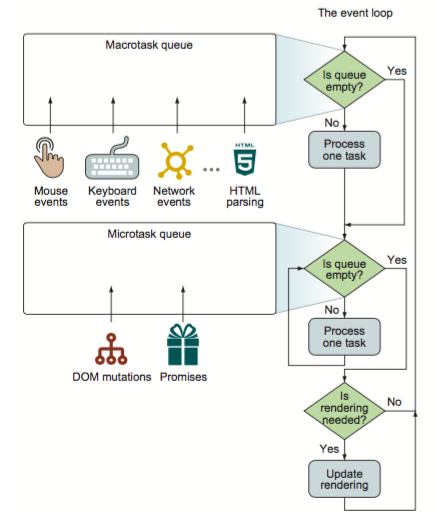

# Javascript 개념 정리
https://github.com/leonardomso/33-js-concepts을 참고하여 자바 스크립트 개발자가 알아야할 개념을 정리했다.

---

## 목차
1.  **[Call Stack](#call-stack)**
1.  **[Primitive Types](#primitive-types)**
1.  **[Value Types and Reference Types](#value-types-and-reference-types)**
1.  **[Implicit, Explicit, Nominal, Structuring and Duck Typing](#implicit-explicit-nominal-structuring-and-duck-typing)**
1.  **[== vs === vs typeof](#-vs--vs-typeof)**
1.  **[Function Scope, Block Scope and Lexical Scope](#function-scope-block-scope-and-lexical-scope)**
1.  **[Expression vs Statement](#expression-vs-statement)**
1.  **[IIFE, Modules and Namespaces](#iife-modules-and-namespaces)**
1.  **[Message Queue and Event Loop](#message-queue-and-event-loop)**
1.  **[setTimeout, setInterval and requestAnimationFrame](#settimeout-setinterval-and-requestanimationframe)**
1.  **[JavaScript Engines](#javascript-engines)**
1.  **[Bitwise Operators, Type Arrays and Array Buffers](#bitwise-operators-type-arrays-and-array-buffers)**
1.  **[DOM and Layout Trees](#dom-and-layout-trees)**
1.  **[Factories and Classes](#factories-and-classes)**
1.  **[this, call, apply and bind](#this-call-apply-and-bind)**
1.  **[new, Constructor, instanceof and Instances](#new-constructor-instanceof-and-instances)**
1.  **[Prototype Inheritance and Prototype Chain](#prototype-inheritance-and-prototype-chain)**
1.  **[Object.create and Object.assign](#objectcreate-and-objectassign)**
1.  **[map, reduce, filter](#map-reduce-filter)**
1.  **[Pure Functions, Side Effects and State Mutation](#pure-functions-side-effects-and-state-mutation)**
1.  **[Closures](#closures)**
1.  **[High Order Functions](#high-order-functions)**
1.  **[Recursion](#recursion)**
1.  **[Collections and Generators](#collections-and-generators)**
1.  **[Promises](#promises)**
1.  **[async/await](#asyncawait)**
1.  **[Data Structures](#data-structures)**
1.  **[Expensive Operation and Big O Notation](#expensive-operation-and-big-o-notation)**
1.  **[Algorithms](#algorithms)**
1.  **[Inheritance, Polymorphism and Code Reuse](#inheritance-polymorphism-and-code-reuse)**
1.  **[Design Patterns](#design-patterns)**
1.  **[Partial Applications, Currying, Compose and Pipe](#partial-applications-currying-compose-and-pipe)**
1.  **[Clean Code](#clean-code)**

---

## Call Stack
*  call stack(호출 스택)은 프로그램에서 우리가 어디에 있는 지를 기본적으로 기록하는 데이터 구조이다.
*  자바스크립트는 single-thread 프로그래밍 언어이므로, 하나의 호출 스택이 있다.
*  함수를 실행하면 해당 함수의 기록을 스택 맨 위에 추가(push)한다.
*  함수가 리턴되면 스택에 쌓여있던 함수는 제거(pop)된다.
### 함수 실행, 리턴 중 호출 스택 상태
```js
function multiply(x, y) {
    return x * y;
}
function printSquare(x) {
    var s = multiply(x, x);
    console.log(s);
}
printSquare(5);
```

### 예외 처리 시 스택의 동작
```js
function foo() {
    throw new Error('SessionStack will help you resolve crashes :)');
}
function bar() {
    foo();
}
function start() {
    bar();
}
start();
```

### Stack Overflow
스택의 사이즈를 초과 했을 때 발생하는 오류이다. 아래와 같이 재귀 호출 시 발생 시킬 수 있다.
```js
function foo() {
    foo();
}
foo();
```
### 단일 호출 스택의 문제점
하나의 함수 실행이 지연될 경우 다른 함수 실행이 늦어지는 문제가 있다.

**[? 목차](#목차)**

---

## Primitive Types
*  Number
*  String
*  Boolean
*  Null
*  Undefined
*  Symbol
### Number
#### 정수
```javascript
var decimalNum = 100; // 기본 숫자 리터럴 형식 10진수로 초기화
var octalNum = 010; // 8진수로 초기화
var hexNum = 0x10; // 16진수로 초기화
```
#### 부동소수점
```javascript
var floatNum1 = 3.14;
var floatNum2 = 3.125e7;
```
##### 부동소수점 사칙연산 부정확
0.1 + 0.2 결과는 0.30000000000000004로 아래 코드는 의도대로 동작하지 않는다.
```javascript
var f1 = 0.1;
var f2 = 0.2;

if (f1 + f2 == 0.3) {
    do_something();
}
```
#### 숫자 범위
*  최소값 : Number.MIN_VALUE (5e-324)
*  최대값 : Number.MAX_VALUE (1.7976931348623157e+308)
*  최소, 최대를 벗어나면 양수는 Infinity, 음수는 -Infinity로 변환된다.
#### NaN
*  Not-a-Number의 줄임말
*  값이 숫자가 아님을 뜻한다.
*  숫자를 0으로 나눈 경우 결과 값이 NaN이다.
*  NaN == NaN은 false이다.
*  isNaN 함수를 사용하여 검사한다.
#### 문자열을 숫자로 변환하는 함수
*  Number()
*  parseInt()
*  parseFloat()

---

### String
*  텍스트 데이터를 나타내는데 사용한다.
*  16비트 부호없는 정수 값 요소들의 집합이다.
*  String 의 길이는 String이 가지고 있는 요소의 갯수이다.
*  문자열이 생성되면, 그 문자열을 수정할 수 없다.
*  기존 문자열을 String.substr(), String.concat() 같은 method나 접합 연산자(+)를 사용해 새로운 문자열을 만든다.
#### 문자열로 변환하는 함수
*  toString() method는 값에 해당하는 문자열을 반환한다.
```javascript
var hundred = 100;
var hundred_string = hundred.toString(); // 문자열 "100"
var is_true = true;
var is_true_string = is_true.toString(); // 문자열 "true"
var hex_num = 10;
var hex_num_string = hex_num.toString(16); // 16진수 문자열 "a"
```
*  String() 함수는 null이나 undefined도 사용 가능하다. (*toString은 불가능*)
```javascript
var im_null = null;
var im_null_string = String(im_null); // 문자열 "null"
var im_undefined = undefined;
var im_undefined_string = String(im_undefeind); // 문자열 "undefined"
```

---

### Boolean
주어진 조건이 참인지 거짓인지 나타내는 자료형이다.
```javascript
1 < 2; // true
1 > 2; // false
3 === 3; // true
3 !== 3; // false
Number.isFinite(Infinity); // false
Number.isNaN(NaN); // true
'hello'.includes('ll'); // true
```

---

### Null
*  어떤 값이 *의도적으로* 비어있음을 표현한다.
*  null 값을 가진 객체 변수는 어떠한 객체도 가리키고 있지 않는 상태이다.
*  함수에서 리턴값을 기대하지만 일치하는 값이 없을 경우에 null을 리턴하는 식으로 사용한다.
*  null과 undefined 차이
```javascript
typeof null          // "object" (하위호환 유지를 위해 "null"이 아님)
typeof undefined     // "undefined"
null === undefined   // false
null  == undefined   // true
null === null        // true
null == null         // true
!null                // true
isNaN(1 + null)      // false
isNaN(1 + undefined) // true
```

---

### Undefined
*  선언한 후 값을 할당하지 않은 변수 혹은 값이 주어지지 않은 인수에 자동으로 할당된다.
```javascript
var x; // 값을 할당하지 않고 변수 선언
console.log("x's value is", x) // "x's value is undefined" 출력
```

---

### Symbol
*  ECMAScript 2015에서 새로 등장한 원시 타입이다.
*  전역 function/object인 Symbol을 호출하면 타입이 symbol이 된다.
```javascript
var mySymbol = Symbol(); // typeof mySymbol -> "symbol"
```
*  Symbol은 “new” 키워드를 사용하지 못 한다.
```javascript
var mySymbol = new Symbol(); //throws error
```
*  Symbol은 description을 가진다.
```javascript
// mySymbol variable now holds a "symbol" unique value
// its description is "some text"
var mySymbol = Symbol('some text');
```
*  Symbol은 unique하다.
```javascript
var mySymbol1 = Symbol('some text');
var mySymbol2 = Symbol('some text');
mySymbol1 == mySymbol2 // false
```
*  Symbol.for를 사용하면 Symbol이 싱글톤처럼 작동한다.
```javascript
var mySymbol1 = Symbol.for('some key'); //creates a new symbol
var mySymbol2 = Symbol.for('some key'); // **returns the same symbol
mySymbol1 == mySymbol2 //true
```
*for 메서드를 사용하는 이유는 어떤 한곳에서 Symbol을 만들고 다른 곳에서 같은 Symbol에 접근하기 위해서이다.*
*  Symbol은 객체 프로퍼티 키일 수 있다.
객체에 Symbol을 속성키로 붙일 수 있다. Symbol은 unique 하기 때문에 이름 충돌없이 객체의 속성을 계속 추가할 수 있다.
```javascript
var mySymbol = Symbol("some car description");
var myObject = { name: 'bmw' };
myObject[mySymbol] = 'This is a car';
console.log(mySymbol); // Symbol(some car description)
console.log(myObject[mySymbol]); // This is a car
console.log(myObject.mySymbol); // x
```
**[? 목차](#목차)**

---

## Value Types and Reference Types
### Value Types
*  자바스크립트는 값에 의한 전달(passed by value)이 일어나는 6가지의 데이터 타입(Boolean, Null, Undefined, String, Number, Symbol)을 가지고 있다. 
*  이러한 데이터 타입을 원시 타입(Primitive Types)이라고 부른다.
*  어떠한 원시 타입이 변수에 할당 된다면, 그 변수를 원시 타입을 가진 변수라고 생각할 수 있다.
```js
var x = 10;
var y = 'abc';
var z = null;
```
*  위에서 x는 10이란 값을 가지고 있고, y는 abc란 값을 가지고 있다.
*  이 변수들을 다른 변수에 `=` 키워드를 이용하여 할당할 때, 새로운 변수에 값을 복사(copy)하게 된다.
```js
var x = 10;
var y = 'abc';

var a = x;
var b = y;

console.log(x, y, a, b); // -> 10, 'abc', 10, 'abc'
```
*  위에서 a와 x는 둘 다 10이란 값을 갖게 된다. 
*  b와 y는 둘 다 abc라는 값을 갖고 있다.
*  이들은 값들이 복사 된 것이기 때문에 각각의 변수들은 서로 관계가 없다.

### Reference Types
*  자바스크립트는 참조에 의한 전달(passed by reference)이 일어나는 3가지 데이터 타입(Array, Function, Object)도 가지고 있다.
*  위 3가지 데이터 타입은 크게 보면 전부 객체(Object)로 볼 수 있다.
*  원시 타입이 아닌 값이 할당된 변수들은 그 값으로 향하는 참조(reference)를 갖게 된다.
*  참조(reference)는 메모리에서 객체의 위치를 가리키고 있다. 즉, 변수는 실제로 값을 가지고 있지 않다.
*  `arr = []`를 작성하면 메모리에 배열이 생성된다. 변수 `arr`이 갑는 것은 그 배열이 위치한 주소이다.
*  객체와 같은 참조 타입의 값이 `=` 키워드로 다른 변수로 복사될 때 그 주소값(참조)이 복사된다. 
```js
var reference = [1];
var refCopy = reference;
```
*  두 변수가 같은 배열을 참조한다는 것을 아래와 같이 확인할 수 있다.
```js
reference.push(2);
console.log(reference, refCopy); // -> [1, 2], [1, 2]
```
**[? 목차](#목차)**

---

## Implicit, Explicit, Nominal, Structuring and Duck Typing
### Type Coersion
```
true + false
==> 1 + 0
==> 1

`+` 연산자가 true와 false를 numeric conversion한다.  
```
```
12 / '6'
==> 12 / 6
==> 2

`/` 연산자가 string '6'을 numeric conversion한다.
```
```
"number" + 15 + 3 
==> "number15" + 3 
==> "number153"

`+` 연산자는 좌에서 우로 결합한다. 
그래서 "number"와 15가 먼저 실행되는데 `+` 연산자가 숫자 15를 string conversion한다.  
그 결과 "number15"가 되고 다시 숫자 3이 string conversion된다.
```
```
15 + 3 + "number" 
==> 18 + "number" 
==> "18number"

15 + 3이 18로 계산되고 `+` 연산자가 18을 string conversion한다.
```
```
[1] > null
==> '1' > 0
==> 1 > 0
==> true

`>` 연산자가 [1]과 null을 numeric conversion을 한다.
```
```
"foo" + + "bar" 
==> "foo" + (+"bar") 
==> "foo" + NaN 
==> "fooNaN"

단항 연산자 `+` 연산자가 결합 순위가 높기 때문에 +"bar"이 먼저 평가된다.  
그리고 이항 `+` 연산자가 NaN을 string conversion한다.
```
```
'true' == true
==> NaN == 1
==> false

false == 'false'   
==> 0 == NaN
==> false

`==` 연산자는 numeric conversion를 한다. 'true'는 NaN으로, true는 1로 변환된다.
```
```
null == ''
==> false

`==` 연산자는 보통 numeric conversion을 하지만, null과 함께 할 때만 그렇지 않다.  
null은 null이나 undefined일 때만 같고 다른 모든 것들과는 다르다.
```
```
!!"false" == !!"true"  
==> true == true
==> true

`!!` 연산자는 'true'와 'false' 문자열이 둘 다 빈 문자열이 아니기 때문에 true로 변환한다.  
```
```
['x'] == 'x'  
==> 'x' == 'x'
==>  true

`==` 연산자는 Array에 대해 numeric conversion을 한다. 
Array의 `valueOf()` method는 Array 자신을 리턴하는데 그것은 원시값(primitive)이 아니기 때문에 무시된다.  
Array의 `toString()`은 ['x']를 'x' 문자열로 변환한다.
```
```
[] + null + 1  
==>  '' + null + 1  
==>  'null' + 1  
==> 'null1'

`+` 연산자는 []을 numeric conversion한다. Array의 `valueOf()` method는 그 자신을 리턴하기 때문에 무시된다.  
Array의 `toString()`은 빈 문자열을 리턴한다.
```
```
0 || "0" && {}  
==>  (0 || "0") && {}
==> (false || true) && true  // internally
==> "0" && {}
==> true && true             // internally
==> {}

논리 `||`, `&&` 연산자는 피연산자를 내부적으로 boolean으로 변환한다. 
하지만 리턴은 boolean이 아닌 원래 피연산자를 리턴한다.  
```
```
[1,2,3] == [1,2,3]
==>  false

피연산자들이 같은 타입이기 때문에 형변환이 필요없다. 
그래서 `==` 연산자는 동일한 object인지 확인한다. (object의 내용이 같은지 확인하는 것이 아니다.)  
이 두 Array는 각각의 다른 인스턴스이기 때문에 같지 않다. 
```
```
{}+[]+{}+[1]
==> +[]+{}+[1]
==> 0 + {} + [1]
==> 0 + '[object Object]' + [1]
==> '0[object Object]' + [1]
==> '0[object Object]' + '1'
==> '0[object Object]1'

모든 피연산자가 원시값이 아니다.  그래서 `+` 연산자는 왼쪽부터 numeric conversion을 한다.  
첫 번째 {}는 object 리터럴이 아닌 블록문으로 처리되어 무시된다. 
그래서 +[] 표현부터 평가되는데 `toString()` method에 의해 빈 문자열로 변환되고 그 다음 0으로 된다.
```
```
!+[]+[]+![]  
==> (!+[]) + [] + (![])
==> !0 + [] + false
==> true + [] + false
==> true + '' + false
==> 'truefalse'

연산자 우선 순위를 따라 처리된다.
```
```
new Date(0) - 0
==> 0 - 0
==> 0

`-` 연산자는 Date를 numeric conversion한다. `Date.valueOf()`는 Unix epoch부터 밀리초를 리턴한다.
```
```
new Date(0) + 0
==> 'Thu Jan 01 1970 02:00:00 GMT+0200 (EET)' + 0
==> 'Thu Jan 01 1970 02:00:00 GMT+0200 (EET)0'

`+` 연산자는 default conversion을 한다. Date는 string conversion이 default라서 `toString()` method가 사용된다.
```

---

### Nonimal Typing
C++, Java, Swift 같은 언어들이 주요 nominal type system이다.
```javascript
class Foo { method(input: string) { /* ... */ } }
class Bar { method(input: string) { /* ... */ } }

let foo: Foo = new Bar(); // Error!
```
클래스 이름이 다른 변수에 대입하려고 할 때 에러가 발생한다.

---

### Structural Typing
OCaml, Haskell, Elm 같은 언어들이 주요 structural type system이다.
```javascript
class Foo { method(input: string) { /* ... */ } }
class Bar { method(input: string) { /* ... */ } }

let foo: Foo = new Bar(); // Works!
```
structure가 완벽하게 같은 클래스는 이름이 달라도 대입이 가능하다.  
그러나 클래스 내용을 변경하면 에러가 발생한다.  
```javascript
class Foo { method(input: string) { /* ... */ } }
class Bar { method(input: number) { /* ... */ } }

let foo: Foo = new Bar(); // Error!
```

---

### Duck Typing
*  Duck Typing은 인자가 어떤 형인지 상관 없이 그 동작을 할 수 있는지를 확인하여 객체를 판단하는 방법이다. 
*  "오리처럼 걷고, 오리처럼 소리 내면 오리로 간주한다(If it walks like a duck and quacks like a duck, I would call it a duck.)"는 말에서 유래했다.
아래는 자동 급식 장치를 Javascript로 구현한 예제이다. 자동 급식 장치 앞에서 "꽥" 소리를 내면, 즉 quack() method를 수행하면 모이를 제공한다.
```javascript
function FeedDispenser() {}; 
FeedDispenser.prototype.requestFeed = function(quackable) {
    return (quackable.quack() != null) ? new Feed() : null; 
};
```

다음은 Goose 객체를 구현한 예제이다.
```javascript
function Goose() {};
Goose.prototype.honk = function() {
    return honk();
}
```

프로토타입 객체에 quack() 메서드를 추가로 구현한다.
```javascript
Goose.prototype.quack = function() {
    return this.honk(); 
}
```

위와 같이 확장된 Goose 인스턴스를 자동 급식 장치에 적용하면 다음과 같다.
```javascript
var goose = new Goose();
var feedDispenser = new FeedDispenser();
var feed = feedDispenser.requestFeed(goose);
console.log(feed != null); // true
```
**[? 목차](#목차)**

---

## == vs === vs typeof
### ==
`==` 연산자는 동등 연사자로 피연산자가 서로 다른 타입이면 타입을 강제로 변환하여 비교한다.
```js
0 == ''     //true
0 == '0'     //true
1 == true     //true
false == '0'    //true
null == undefined    //true
false == null    //false
false == undefined    //false
```
### === 
`===` 연산자는 일치 연산자로 두 피연산자를 더 정확하게 비교한다.
```js
0 === ''     //false
0 === false    //false
1 === true     //false
NaN === NaN     //false
null === undefined     //false
```
### typeof
*  typeof는 변수의 데이터 타입을 반환하는 연산자이다.
*  사용법 : typeof variable
*  반환되는 값
	*  undefined : 변수가 정의되지 않거나 값이 없을 때
	*  number : 데이터 타입이 수일 때
	*  string : 데이터 타입이 문자열일 때
	*  boolean : 데이터 타입이 불리언일 때
	*  object : 데이터 타입이 함수, 배열 등 객체일 때
	*  function : 변수의 값이 함수일 때
	*  symbol : 데이터 타입이 심볼일 때
  
**[? 목차](#목차)**

---

## Function Scope, Block Scope and Lexical Scope
###  Global Scope  
Javascript document에는 오직 하나의 global scope만 존재한다.  
함수 바깥에 정의된 변수는 global scope에 속한다.
```javascript
// the scope is by default global
var name = 'msahn';
```
```javascript
var name = 'msahn';

console.log(name); // logs 'msahn'

function logName() {
    console.log(name); // 'name' is accessible here and everywhere else
}

logName(); // logs 'msahn'
```

---

### Local Scope  
함수 안에서 정의된 변수는 local scope에 속한다.
```javascript
// Global Scope
function someFunction() {
    // Local Scope #1
    function someOtherFunction() {
        // Local Scope #2
    }
}

// Global Scope
function anotherFunction() {
    // Local Scope #3
}
// Global Scope
```

---

### Block statements
Block statement는 function과 달리 `if`와 `switch` 같은 condition문이나 `for`와 `while`같은 loop문이다.
```javascript
if (true) {
    // this 'if' conditional block doesn't create a new scope
    var name = 'msahn'; // name is still in the global scope
}

console.log(name); // logs 'msahn'
```
```javascript
if (true) {
    // this 'if' conditional block doesn't create a scope

    // name is in the global scope because of the 'var' keyword
    var name = 'msahn';
    // likes is in the local scope because of the 'let' keyword
    let likes = 'Coding';
    // skills is in the local scope because of the 'const' keyword
    const skills = 'JavaScript';
}

console.log(name); // logs 'msahn'
console.log(likes); // Uncaught ReferenceError: likes is not defined
console.log(skills); // Uncaught ReferenceError: skills is not defined
```

---

### Lexical Scope  
lexical scope는 포개어진 함수 그룹을 의미한다.  
안쪽의 함수는 그 부모 scope의 변수와 resource에 접근이 가능하다.
```javascript
function grandfather() {
    var name = 'msahn';
    // likes is not accessible here
    function parent() {
        // name is accessible here
        // likes is not accessible here
        function child() {
            // Innermost level of the scope chain
            // name is also accessible here
            var likes = 'Coding';
        }
    }
}
```

**[? 목차](#목차)**

---

## Expression vs Statement
### Expression
*  Expression이란 값을 산출해내는 코드를 말한다.
*  값이 도출되기 때문에 함수의 인자로 들어갈 수 있다.
```js
3;
'hello';
myVar;
5+5;
myFunc('a', 'b');
```
### Statement
*  Statement란 특정 액션을 수행하는 코드를 말한다.
*  Statement는 값을 도출할 수 있으며 이를 Expression Statement라고 칭하게 된다.
*  Statement 중에서 if Statement나 for Statement처럼 그 자체로는 값을 도출하지 않을 수 있고 이것들은 함수의 인자로도 들어갈 수 없다.
*  모든 Expression은 Statement이지만, 모든 Statement가 Expression은 아니다.
### Function Expression vs Function Statement
*  Function은 아래처럼 Expression 및 Statement 형식으로 선언될 수 있다.
```js
// Function Expression
var greet = function() {
  console.log("Hello");
};

// Function Statement
function greet() {
  console.log("Hello");
}
```
*  greet() 실행문을 함수 선언 위에 추가할 경우 Function Expression은 undefined가 도출되고, Function Statement는 Hello가 출력된다.  

**[? 목차](#목차)**

---

## IIFE, Modules and Namespaces
### IIFE (Immediately-Invoked Function Expressions)
*  IIFE는 정의와 동시에 호출되는 함수이다.
```javascript
(function sayHi() {
        alert('Hi there!'); 
    }
)(); 
// alerts 'Hi there!'
```
*  IIFE로 인자 전달하기
```javascript
(function (name) { 
        alert(`Hi, ${name}`); 
    }
)('Kim'); 
// alerts 'Hi, Kim'
```
*  IIFE의 주요 사용 용도는 private scope를 만들기 위해서 이다. 다시 말해 내부의 코드가 global scope를 더럽히는 것을 방지하고 내부 변수를 외부에서 참조하지 못 하도록 보호하기 위해서 이다.  
아래는 버튼 클릭 수를 세는 예제이다.
```html
<!-- button.html --> 
<html>
    <body>
        <button id='button'>Click me!</button>
        <script src='button.js'>
        </script> 
    </body>
</html>
```
```javascript
// button.js
const button = document.getElementById('button');

button.addEventListener('click', (function() {
    let count = 0;
    return function() {
        count += 1;

        if (count === 2) {
            alert('This alert appears every other press!');
            count = 0;
        }
    };
})());
```
*  특정한 실행 context를 생성하기 위해 오직 한 번 실행되는 의도로 사용된다.
*  ES5에서는 변수의 scope가 function에 의해서만 정해질 수 있었기 때문에 사용 되었다. ES6부터는 let, const, module로 대체할 수 있다.

---

### Modules
*  클라이언트 사이드 자바스크립트는 script 태그를 사용하여 외부의 스크립트 파일을 가져올 수는 있지만, 파일마다 독립적인 파일 스코프를 갖지 않고 하나의 전역 객체(Global Object)를 공유한다.
*  서버 사이드 자바스크립트 런타임 환경인 Node.js는 모듈 시스템의 사실상 표준(de facto standard)인 CommonJS를 채택하였고 독자적인 진화를 거쳐 현재는 CommonJS 사양과 100% 동일하지는 않지만 기본적으로 CommonJS 방식을 따르고 있다.
*  ES6에서는 클라이언트 사이드 자바스크립트에서도 동작하는 모듈 기능을 추가하였다. 2019년 11월 현재, 모던 브라우저(Chrome 61, FF 60, SF 10.1, Edge 16 이상)에서 ES6 모듈을 사용할 수 있다.
*  script 태그에 type="module" 어트리뷰트를 추가하면 로드된 자바스크립트 파일은 모듈로서 동작한다. ES6 모듈의 파일 확장자는 모듈임을 명확히 하기 위해 mjs를 사용하도록 권장한다.
```html
<script type="module" src="lib.mjs"></script>
<script type="module" src="app.mjs"></script> 
```
*  단, 아래와 같은 이유로 아직까지는 브라우저가 지원하는 ES6 모듈 기능보다는 Webpack 등의 모듈 번들러를 사용하는 것이 일반적이다.
    *  IE를 포함한 구형 브라우저는 ES6 모듈을 지원하지 않는다.
    *  브라우저의 ES6 모듈 기능을 사용하더라도 트랜스파일링이나 번들링이 필요하다.
    *  아직 지원하지 않는 기능(Bare import 등)이 있다.
    *  점차 해결되고는 있지만 아직 몇가지 이슈가 있다.

---

### Namespaces
*  Namespace 패턴은 전역 공간에 변수를 생성하고 코드를 사용하는 것을 방지하기 위해 네임스페이스라는 분리된 공간을 만들어 그 안에서 변수를 선언하고 코드를 작성하도록 하는 패턴이다.
*  Namespace 생성
```javascript
var NAMESPACE = {}; // 네임스페이스 생성

NAMESPACE.number = 1; // 변수 생성
NAMESPACE.func = function() {}; // 함수 생성
NAMESPACE.obj = {}; // 객체 생성
``` 
*  Namespace 이름은 충돌 방지를 위해 모두 대문자를 사용한다.
*  모든 변수와 함수에 접두어를 붙여야 하기 때문에 전체적으로 코드량이 약간 더 많아지고 따라서 파일 크기도 늘어난다.
*  이름이 중첩되고 길어지므로 프로퍼티를 판별하기 위한 검색 작업도 길고 느려진다. 

**[? 목차](#목차)**

---

## Message Queue and Event Loop
### 브라우저에서 자바스크립트 런타임 환경
  
*  Heap  
  생성된 자바스크립트 객체가 존재하는 메모리
*  Stack(Call Stack)  
  현재 프로그램이 실행하고 있는 작업을 기록하는 자료 구조
*  Web APIs  
  Document, AJAX, Event, Timing 등 코어 자바스크립트에 없는 기능을 지원한다. 브라우저에서 지원하는 기능들이다. 대표적으로 setTimeout이 있다. 기능 수행 후 callback을 Message Queue에 추가한다.
*  Message Queue(Callback Queue, Event Queue)  
  처리해야 하는 Event들을 임시 저장하는 대기 queue
*  Event Loop  
  Call Stack이 비워졌을 때 Message Queue에 대기하고 있는 Event가 Call Stack에 push 된다.
### Microtask, Microtask queue(Job queue)

*  Microtask는 Macrotask보다 우선 순위가 높다.
*  Macrotask는 항상 JS 코드 실행이 완료되고 Microtask Queue가 비어있는 후에 실행된다.
*  JS 코드 실행 자체는 Macrotask이다.
*  Microtask 큐를 비운 후 UI를 다시 렌더링 할 수 있다.
*  Promise는 Microtask에 속하고 setTimeout은 Macrotask에 속한다.
*  실행 순서는 다음과 같다. General code->Promises->Events and setTimeout etc.
*  아래 코드의 출력 순서 : script start -> script end -> promise1 -> promise2 -> requestAnimationFrame -> setTimeout
```js
console.log("script start");

setTimeout(function() {
  console.log("setTimeout");
}, 0);

requestAnimationFrame(function() {
    console.log("requestAnimationFrame");
});

Promise.resolve().then(function() {
  console.log("promise1");
}).then(function() {
  console.log("promise2");
});

console.log("script end");
```


**[? 목차](#목차)**

---

## setTimeout, setInterval and requestAnimationFrame
### setTimeout
*  setTimeout 함수는 설정한 시간만큼 기다린 후 단 한번 지정한 함수를 실행한다.
*  정지하려면 clearTimeout을 호출한다.
```javascript
/* 실행 */
var loopTimer = setTimeout(function(){ /* process... */}, delay);
/* 정지 */
clearTimeout(loopTimer);
```
*  setTimeout 함수는 단 한번 지정된 함수를 실행하지만 재귀 호출을 통해 반복적으로 실행 할 수 있다.
*  만약 delay를 100ms로 설정했다면 지정된 함수가 실행되는 간격은 100ms 이상이다.


### setInterval
*  setInterval 함수는 설정한 시간만큼 기다린 후 지정한 함수를 실행하고 이 동작을 반복한다.
*  정지하려면 clearInterval을 호출한다.
```javascript
/* 실행 */
var onceTimer = setInterval(function(){ /* process... */ }, delay); 
/* 정지 */
clearInterval(onceTimer);
```
*  브라우저가 함수를 실행할 수 없는 상태(busy)라면 이벤트를 최대 길이가 1인 큐에 저장한다.
*  큐에 이미 이벤트가 존재한다면 그 이벤트는 skip 된다.
*  만약 delay를 100ms로 설정했다면 실제 delay는 100ms보다 적다.


### setTimeout, setInterval limitations
*  브라우저는 setTimeout의 5개 이상의 중첩 호출 또는 setInterval(5 번째 호출 이후)에 대한 최소 지연을 4ms로 제한한다. (historical reason?)
*  브라우저 내장 타이머는 여러 이유들로 인해 느려질 수 있다.
    *  CPU 과부하
    *  브러우저 탭이 백그라운드 모드에 있을 때
    *  랩탑이 배터리로 사용 중 일 때

### requestAnimationFrame
*  전통적으로 javascript에서 애니메이션을 만들 때는 setTimeout이나 setInterval을 사용했었다.
```js
var adiv = document.getElementById('mydiv')
var leftpos = 0
setInterval(function(){
    leftpos += 5
    adiv.style.left = leftpos + 'px' // move div by 5 pixels each time
}, 50) // run code every 50 milliseconds
```
*  위 코드는 논리적으로 그럴듯 하지만 실제 동작은 완벽하지 않다. 이유는 다음과 같다.
    *  시스템 리소스 변동으로 인해 지연 간격이 일정하지 않다.
    *  화면을 지속적으로 변경하기 위해 과도하게 setTimeout, setInterval을 사용하면 layout thrashing으로 인해 성능 저하가 유발된다.
*  requestAnimationFrame method는 실제 화면이 갱신되어 표시되는 주기에 따라 함수를 호출해주기 때문에 자바스크립트가 프레임 시작 시 실행되도록 보장한다.
*  보통 1초에 60회 정도 실행이 되지만 대부분의 브라우저는 W3C 권장사항에 따라 디스플레이 주사율과 일치하도록 실행된다.
*  requestAnimationFrame()는 현재 창에 표시 되지 않으면 애니메이션을 중지한다.
```js
var adiv = document.getElementById('mydiv')
var leftpos = 0
requestAnimationFrame(function(timestamp){
    leftpos += 5
    adiv.style.left = leftpos + 'px'
})
```
**[? 목차](#목차)**

---

## JavaScript Engines
### JavaScript Engine Pipeline
자바스크립트 엔진이 소스 코드를 기계어로 만들기까지 공통적으로 수행하는 과정  

1. 소스 코드를 파싱하여 [Abstract Syntax Tree](https://ko.wikipedia.org/wiki/%EC%B6%94%EC%83%81_%EA%B5%AC%EB%AC%B8_%ED%8A%B8%EB%A6%AC)(AST)를 생성
2. 인터프리터는 AST를 바탕으로 바이트코드 생성 (실제로는 여기까지가 엔진이 실행하는 부분)
3. 코드를 더 빠르게 실행하기 위해 바이트 코드와 프로파일링 데이터를 최적화 컴파일러에게 보냄
4. 최적화 컴파일러는 프로파일링 데이터를 기반으로 최적화된 기계어를 생성
5. 정확하지 않은 결과가 나오면 다시 deoptimize하여 바이트 코드로 되돌림


*  인터프리터(interpreter)  
  최적화 되지 않은 바이트 코드를 빠르게 생성한다.
*  최적화 컴파일러(optimizing compiler)  
  최적화된 기계어 코드를 생성한다.
*  이 과정에서 바이트 코드는 중간 언어(IR: Intermediate Representation)이다. `interpreter` 모드라면 바이트 코드를 하나씩 읽어서 실행하고, `JIT` 모드라면 바이트 코드를 기반으로 컴파일하여 수행한다.
*  바이트 코드(Byte code)  
  특정 하드웨어가 아닌 가상 컴퓨터에서 돌아가는 실행 프로그램을 위한 이진 표현법. 하드웨어가 아닌 소프트웨어에 의해 처리되기 때문에 보통 기계어보다 더 추상적이다.
*  JIT 컴파일(Just-In-Time Compilation) 또는 동적 번역(Dynamic Translation)은 프로그램을 실제 실행하는 시점에 기계어로 번역하는 컴파일 기법이다. 이 기법은 프로그램의 실행 속도를 빠르게 하기 위해 사용된다.
*  인터프리터는 바이트 코드를 빠르게 생성할 수 있지만 효율적인 코드가 아니다. 반대로 최적화 컴파일러는 시간이 조금 더 걸리지만 효율적인 기계 코드를 생성한다.


*  V8의 세부 파트는 이름 그대로 자동차의 8기통 엔진이 떠어로는 네이밍을 하고 있다.
*  인터프리터는 `Ignition`이라고 부르며 코드를 점화하여 바이트 코드를 생성 및 실행한다.
*  바이트 코드가 실행될 때 인터프리터는 프로파일링 데이터를 수집하여 나중에 최적화 할 때 사용한다.
*  특정 함수를 자주 수행하게 되면 바이트 코드와 프로파일링 데이터를 `TurboFan`이라고 부르는 최적화 컴파일러로 보내서 최적화된 기계어를 만들어낸다.


**[? 목차](#목차)**

---

## Bitwise Operators, Type Arrays and Array Buffers
### Bitwise Operators
연산자 | 사용법 | 설명
---|---|--
Bitwise AND|a & b|왼쪽과 오른쪽 피연사자의 비트가 1이면 각 비트를 1로 리턴
Bitwise OR|a | b|왼쪽이나 오른쪽 피연산자의 비트가 1이면 각 비트를 1로 리턴
Bitwise XOR|a ^ b|왼쪽이나 오른쪽 피연산자의 비트 중 한 쪽만 1이면 각 비트를 1로 리턴
Bitwise NOT|~ a|피연산자의 모든 비트를 반전 시킴
Left shift|a << b|a를 오른쪽에서 왼쪽으로 b 비트 만큼 이동 시키고 0으로 채움
Sign-propagating right shift|a >> b|a를 왼쪽에서 오른쪽으로 b 비트 만큼 이동 시키고 양수일 경우 0으로, 음수일 경우 1로 채움
Zero-fill right shift|a >>> b|a를 왼쪽에서 오른쪽으로 b 비트 만큼 이동 시키고 0으로 채움
  
### Type Arrays and Array Buffers
*  원시(raw) 이진 데이터 엑세스를 위한 객체
*  버퍼와 뷰로 나뉘어 짐
*  버퍼(ArrayBuffer 객체에 의해 구현됨)는 데이터 부분(chunk, 덩어리)을 나타내는 객체
*  형식화 배열 뷰

이름 | 범위 | 설명 | 타입
---|---|---|---
Int8Array|-128 ~ 127|부호있는 8비트 정수|char
Uint8Array|0 ~ 255|부호없는 8비트 정수|unsigned char
Int16Array|-32,768 ~ 32,767|부호있는 16비트 정수|short
Uint16Array|0 ~ 65,535|부호없는 16비트 정수|unsigned short
Int32Array|-2,147,483,648 ~ 2,147,483,647|부호있는 32비트 정수|int
Uint32Array|0 ~ 4,294,967,295|부호없는 32비트 정수|unsigned int
Float32Array|-3.4 x 10의 38승 ~ 3.4 x 10의 38승|32-bit IEEE floating point number|float
Float64Array|-1.79 x 10의 308승 ~ 1.79 x 10의 308승|64-bit IEEE floating point number|double


*  뷰는 버퍼에 데이터를 읽거나 쓸 수 있는 getter/setter API를 제공하는 저레벨 인터페이스
*  버퍼 사용
```js
var buffer = new ArrayBuffer(16);

if (buffer.byteLength === 16) {
  console.log("Yes, it's 16 bytes.");
} else {
  console.log("Oh no, it's the wrong size!");
}
```
*  뷰 사용
```js
var buffer = new ArrayBuffer(16);

var int32View = new Int32Array(buffer);

for (var i = 0; i < int32View.length; i++) {
  int32View[i] = i * 2;
}


var int16View = new Int16Array(buffer);

for (var i = 0; i < int16View.length; i++) {
  console.log("Entry " + i + ": " + int16View[i]);
}

```

*  C 언어 구조체와 작업
```c
  struct someStruct {
  unsigned long id;
  char username[16];
  float amountDue;
};
```
```js
var buffer = new ArrayBuffer(24);

// ... 버퍼 내의 데이터를 읽어들임 ...

var idView = new Uint32Array(buffer, 0, 1);
var usernameView = new Uint8Array(buffer, 4, 16);
var amountDueView = new Float32Array(buffer, 20, 1);
```

**[? 목차](#목차)**

---

## DOM and Layout Trees
*  DOM은 문서 객체 모델(Document Object Model)의 약자이다.
*  DOM은 HTML element를 가져오고 바꾸고 추가하고 삭제하는 방법에 대한 표준이다.
*  DOM은 자료구조 중 트리(Tree) 형식을 하고 있다.  

*  Layout tree는 4 종류의 노드로 구성된다.
	*  문서 노드(Document Node)  
    트리의 최상위에 존재하며 각각 요소, 어트리뷰트, 텍스트 노드에 접근하려면 문서 노드를 통해야 한다. 즉, DOM tree에 접근하기 위한 시작점(entry point)이다.
	*  요소 노드(Element Node)  
    요소 노드는 HTML 요소를 표현한다. HTML 요소는 중첩에 의해 부자 관계를 가지며 이 부자 관계를 통해 정보를 구조화한다. 따라서 요소 노드는 문서의 구조를 서술한다고 말 할 수 있다. 어트리뷰트, 텍스트 노드에 접근하려면 먼저 요소 노드를 찾아 접근해야 한다. 모든 요소 노드는 요소별 특성을 표현하기 위해 HTMLElement 객체를 상속한 객체로 구성된다.
	*  어트리뷰트 노드(Attribute Node)  
    속성 노드는 HTML 요소의 어트리뷰트를 표현한다. 어트리뷰트 노드는 해당 어트리뷰트가 지정된 요소의 자식이 아니라 해당 요소의 일부로 표현된다. 따라서 해당 요소 노드를 찾아 접근하면 어트리뷰트를 참조, 수정할 수 있다.
	*  텍스트 노드(Text Node)  
    텍스트 노드는 HTML 요소의 텍스트를 표현한다. 텍스트 노드는 요소 노드의 자식이며 자신의 자식 노드를 가질 수 없다. 즉, 텍스트 노드는 DOM tree의 최종단이다.
    
**[? 목차](#목차)**

---

## Factories and Classes
### Class로 구현한 ToDo Model
```js
class TodoModel {
    constructor(){
        this.todos = [];
        this.lastChange = null;
    }
    
    addToPrivateList(){
        console.log("addToPrivateList"); 
    }
    add() { console.log("add"); }
    reload(){}
}
```
### Factory function으로 구현한 ToDo Model
```js
function TodoModel(){
    var todos = [];
    var lastChange = null;
        
    function addToPrivateList(){
        console.log("addToPrivateList"); 
    }
    function add() { console.log("add"); }
    function reload(){}
    
    return Object.freeze({
        add,
        reload
    });
}
```
### Encapsulation
*  Class의 모든 멤버, 필드, 메서드는 public이다.
```js
var todoModel = new TodoModel();
console.log(todoModel.todos);     //[]
console.log(todoModel.lastChange) //null
todoModel.addToPrivateList();     //addToPrivateList
```
*  Factory function는 메서드만 노출되고 나머지 다른 것들은 모두 보호된다.
```js
var todoModel = TodoModel();
console.log(todoModel.todos);     //undefined
console.log(todoModel.lastChange) //undefined
todoModel.addToPrivateList();     //todoModel.addToPrivateList is not a function
```
### this
*  class를 사용할 때는 this가 context를 잃는 문제가 있다.
```js
class TodoModel {
    constructor(){
        this.todos = [];
    }
    
    reload(){ 
        setTimeout(function log() { 
           console.log(this.todos);    //undefined
        }, 0);
    }
}
todoModel = TodoModel();
todoModel.reload();
```
*  위 문제는 callback에 화살표 함수를 사용하여 해결 할 수 있다.
```js
class TodoModel {
    constructor(){
        this.todos = [];
    }
    
    reload(){ 
        setTimeout(() => { 
           console.log(this.todos);    //undefined
        }, 0);
    }
}
todoModel = TodoModel();
todoModel.reload();
```
*  Factory function은 this를 사용하지 않기 때문에 문제가 없다.
```js
function TodoModel(){
    var todos = [];
        
    function reload(){ 
        setTimeout(function log() { 
           console.log(todos);        //[]
       }, 0);
    }
}
todoModel = TodoModel();
todoModel.reload();
```
**[? 목차](#목차)**

---

## this, call, apply and bind
### this
*  현재 함수를 부른 객체가 누구인지를 나타낸다.
*  this를 지정하지 않으면 기본적으로 브라우저의 전역객체를 가리킨다.
*  use strict 모드에서는 this를 정의하지 않았을 경우 undefined 가 유지된다.
*  객체의 메소드로 호출 되었을때는 해당 메소드의 객체를 가리킨다.
*  ES6 화살표 함수를 사용한다면 기존의 바인딩을 무시하고 렉시컬 스코프로 this를 바인딩 된다.

### call
*  call 메서드는 모든 함수에서 사용할 수 있으며, this를 특정 값으로 지정할 수 있다.
```js
    const bruce = {
        name : 'Bruce'
    };

    const madeline = {
        name : 'Madeline'
    };

    //이 함수는 어떤 객체에도 연결되지 않았지만 this를 사용함.
    function greet(){
        return `Hello, I'm ${this.name}`;
    };

    greet();               // 'Hello, I'm undefined' - this는 어디에도 묶이지 않음
    greet.call(bruce)     // 'Hello, I'm Bruce'     - this는 bruce
    greet.call(madeline)   // 'Hello, I'm Madeline'  - this는 madeline
```
*  함수를 호출하면서 call을 사용하고 this로 사용할 객체를 넘기면 해당 함수가 주어진 객체의 메서드인 것처럼 사용할 수 있다.
*  call의 첫 번째 매개변수는 this로 사용할 값이고, 매개변수가 더 있으면 그 매개변수는 호출하는 함수로 전달된다.
```js
    function update(birthYear, occupation){
        this.birthYear = birthYear;
        this.occupation = occupation;
    };

    update.call(bruce, 1949, 'singer'); // bruce 변경
    /*
        bruce는 이제
        {
            name : 'Bruce',
            birthYear : 1949,
            occupation : 'singer'
        }
        로 변경됨
     */

    update.call(madeline, 1942, 'actress'); // madeline 변경
    /*
        madeline은 이제
        {
            name : 'Madeline',
            birthYear : 1942,
            occupation : 'actress'
        }
        로 변경됨
     */
```
### apply
*  apply는 함수 매개변수를 처리하는 방법을 제외하면 call과 완전히 같다. 
*  call은 일반적인 함수와 마찬가지로 매개변수를 직접 받지만, apply는 매개변수를 배열로 받는다.
```js
    update.apply(bruce, [1955, 'actor']);
    /*
        bruce는 이제
        {
            name : 'Bruce',
            birthYear : 1955,
            occupation : 'actor'
        }
        로 변경됨
     */

    update.apply(madeline, [1918, 'writer']);
    /*
        madeline은 이제
        {
            name : 'Madeline',
            birthYear : 1918,
            occupation : 'writer'
        }
        로 변경됨
     */
```
*  apply는 배열 요소를 함수 매개변수로 사용해야 할 때 유용하다. 
*  자바스크립트의 내장 함수인 Math.min과 Math.max는 매개변수를 받아 그중 최소값과 최대값을 각각 반환한다.
*  apply를 사용하면 기존 배열을 이들 함수에 바로 넘길 수 있다.
```js
    const arr = [2,3,-5,15,7];

    Math.min.apply(null, arr); // -5
    Math.max.apply(null, arr); // 15
```
### bind
*  bind를 사용하면 함수의 this 값을 영구히 바꿀 수 있다. 
*  update 메서드를 이리저리 옮기면서 호출할 때 this 값은 항상 bruce가 되게끔, call이나 apply, 다른 bind와 함께 호출하더라도 this 값이 bruce가 되도록 하려면 bind를 사용한다.
```js
    const updateBruce = update.bind(bruce);

    updateBruce(1904, "actor");
    // bruce 는 이제 { name: "Bruce", birthYear: 1904, occupation: "actor" }

    updateBruce.call(madeline, 1274, "king");
    // bruce 는 이제 { name: "Bruce", birthYear: 1274, occupation: "king" };
    // madeline은 변하지 않음
```

**[? 목차](#목차)**

---

## new, Constructor, instanceof and Instances
### new
new 연산자를 통해 개발자는 user-defined object type와 생성자 함수가 있는 built-in object type의 인스턴스를 만들 수 있다.  
new 키워드는 다음을 수행한다.  

*  새로운 object가 만들어진다.
*  this를 이 object에 결합한다.
*  생성자 함수의 prototype object는 새 object의 ```__proto__``` property가 된다.
*  함수로부터 object를 리턴한다.

#### ES5 class
```js
function User(name, points) {
  this.name = name; 
  this.points = points;
}
User.prototype.increment = function(){
  this.points++;
}
User.prototype.login = function() {
  console.log(“Please login.”)
}

let user1 = new User(“Dylan”, 6);
user1.increment();
```
#### ES6 class
```js
class User {
  constructor(name, points) {
    this.name = name;
    this.points = points;
  }
  increment () {
    this.points++;
  }
  login () {
    console.log("Please login.")
  }
}

let user1 = new User("John", 12);
user1.increment();
```
#### 새 object를 new로 생성해야 하는 이유
````js
var userProfile = function(name, age) {
    this.userName = name;
    this.userAge = age;
    return this;
};

var user = userProfile('uyeong', 27);
console.log(user === window); // true
console.log(window.userName); // uyeong
console.log(window.userAge); // 27
delete user; // true
delete window.userName; // true
delete window.userAge; // true

var user = new userProfile('uyeong', 27);
console.log(user === window); // false
console.log(window.userName); // undefined
console.log(window.userAge); // undefined
console.log(user.userName); // uyeong
console.log(user.userAge); // 27
````

### instance
*  object는 현실 세계의 개체를 프로그래밍으로 표현한 것이다.
````js
var person = {
  name: 'Juan',
  age: 40,
  gender: 'male',
  greeting: function() {
    alert('Hi! I\'m ' + this.name + '.');
  }
};
````
*  이 object를 사용하기 위해 이 object의 instance를 생성해야 한다.
```js
var guy = new person();
````
*  위 명령어 실행으로 person type의 object를 저장할 수 있는 메모리가 할당 및 초기화 되고 이 instance를 참조 할 수 있는 guy 변수가 만들어 진다.

### instanceof
*  instanceof 는 비교 연산자이다.
*  해당 변수가 사용하고 있는 prototype의 chain을 두 번째 인자와 쭉 비교해서 true나 false를 리턴한다.
*  모든 object는 기본 object인 Object를 확장하기 때문에 instanceof Object는 true이다.
```js
var Person = function(){ 
    this.name = "unikys"; 
}; 

var inst = new Person(); 
inst instanceof Person; // === true 
inst instanceof Object; // === true 
typeof inst; // === 'object'
```
*  primitive type에는 사용할 수 없다.
```js
"foo" instanceof String; // === false 
"foo" instanceof Object; // === false 
true instanceof Boolean; // === false 
true instanceof Object; // === false 

[0,1] instanceof Array; // === true 
{0:1} instanceof Object; // === true 

var color1 = new String("red"); 
var color2 = "red"; 
color1 == color2; // === true 
color1 instanceof String; // === true 
color2 instanceof String; // === false
```

**[? 목차](#목차)**

---

## Prototype Inheritance and Prototype Chain
### Prototype

*  함수를 선언하면 위와 같이 function, prototype 2개의 객체가 생성된다.
*  이 두 객체는 서로 참조 가능한 property를 가지고 있다.
  *  function은 prototype을 통해 prototype 객체에 접근한다.
  *  prototype은 constructor를 통해 function 객체에 접근한다.
*  접근 뿐만이 아니라 변경도 가능하다.
*  function 스스로는 prototype의 property에 접근할 수 없다.
```js
function Foo (){}
Foo.prototype.proto_val = '원형 값';

Foo.prototype.constructor.construct_val = "생성자 값";

console.log(Foo.prototype.proto_val); //원형 값 을 출력
console.log(Foo.construct_val); //생성자 값 을 출력
console.log(Foo.proto_val); //?! undefined를 출력
```


*  instance화 되면 prototype의 property가 접근 할 수 있는 공간에 복제된다.
```js
function Foo (){} //함수 선언
Foo.prototype.proto_val = "접근 할 수있다!!"; //Foo의 프로토타입을 설정

var foo_instance = new Foo();  //Foo의 인스턴스를 생성

console.log(foo_instance.proto_val); //접근 할 수있다!! 를 출력
```
*  instance 안의 property를 변경해도 ```__proto__``` 안의 property는 변하지 않는다.
```js
function Foo(){}

Foo.prototype.proto_val = 100;    //프로토타입 속성을 설정합니다.

var foo_instance = new Foo();  //Foo의 인스턴스를 생성합니다.

console.log(foo_instance.proto_val); //프로토타입값 100을 출력을 합니다.

foo_instance.proto_val -= 1;  // 인스턴스에서 proto_val을 1줄여봅니다.

console.log(foo_instance.__proto__.proto_val); //프로토타입의 값은 그대로입니다.
console.log(foo_instance.proto_val);  //하지만 인스턴스는 1이 줄은 99가 출력이 됩니다.
```

### Prototype Inheritance

*  함수를 선언하는 순간 Object.prototype을 상속하게 된다.
*  prototype chain은 prototype이 다른 prototype을 참조하는 행위가 반복되는 것이다.
```js
Object.prototype.say = function(){
    console.log(this.greet); //Object의 프로토타입에 say라는 메서드를 추가합니다.
}

function Foo (){
    this.greet = "hello world";    // Foo 생성자에서 greet이라는 속성을 추가합니다.
}

var foo_instance = new Foo();     //인스턴스를 생성합니다.

foo_instance.say(); //hello world를 출력합니다.
```
1. instance 내에 say가 있는지 확인한다.  
2. 없다면 instance가 참조하는 prototype에 say가 있는지 확인한다.  
3. 없다면 prototype이 참조하는 prototype에 say가 있는지 확인한다.  
4. 이 과정을 반복하다가 null이 나오면 중단하고 say에 undefined를 할당한다.  
5. say를 찾을 경우 say를 호출한다.  

*  다른 객체끼리의 상속
```js
function Vehicle (){}

Vehicle.prototype.wheels = 4;
Vehicle.prototype.getWheels = function(){ //Vehicle의 프로토타입의 속성을 설정합니다.
    console.log(this.wheels);
}

function Bicycle(){
    this.wheels = 2;
}

Bicycle.prototype.__proto__ = Vehicle.prototype; //Bicycle의 프로토타입이  Vehicle의 프로토타입을 참조하게 합니다.

var bicycle = new Bicycle(); //객체를 생성합니다. 

bicycle.getWheels();  // 2를 출력합니다.
```

1. getWheels method를 실행할 경우 instance bicycle 안에 해당 method가 없기 때문에 prototype Bicycle이 참조하는 Vehicle을 확인한다.  
2. prototype Vehicle 안에는 getWheels method가 있기 때문에 호출한다.  

**[? 목차](#목차)**

---

## Object.create and Object.assign
### Object.create
*  주어진 prototype object와 property로 새로운 object를 만든다.
*  상속을 구현할 때 사용한다.
```
Object.create(prototype[, propertiesObject])
```
```js
function fruits() {
    this.name = 'fruit 1';
}

function apple() {
    fruits.call(this);
}

apple.prototype = Object.create(fruits.prototype);
const app = new apple();
console.log(app.name);  // "fruit 1"
```
### Object.assign
*  열거할 수 있는 하나 이상의 source object로부터 target object로 속성을 복사할 때 사용한다.
```js
var obj1 = { a: 10, b: 10, c: 10 };
var obj2 = { b: 20, c: 20 };
var obj3 = { c: 30 };

var new_obj = Object.assign({}, obj1, obj2, obj3);

console.log(new_obj);  // Object { a: 10, b: 20, c: 30 }
```
**[? 목차](#목차)**

---

## map, reduce, filter
### map
map() 메서드는 배열 내의 모든 요소 각각에 대하여 제공된 함수(callback)를 호출하고 그 결과를 모아서 새로운 배열을 반환한다.
```js
var num = [2, 4, 6, 8];
var result = num.map(function(num) { return num * 10; });
console.log(result); // [20, 40, 60, 80]
```

### reduce
reduce() 메서드는 왼쪽에서 오른쪽으로 이동하며 배열의 각 요소마다 누적 계산값과 함께 함수를 적용해 하나의 값으로 줄인다.
```js
var sumArr = [1, 2, 3, 4, 5, 6, 7, 8, 9, 10];
var result = sumArr.reduce(function(prev, curr) { return prev + curr; });
console.log(result); // 55
```

### filter
filter() 메서드는 제공된 함수로 구현된 테스트를 통화하는 모든 요소가 있는 새로운 배열을 만든다.
```js
var persons = [
  { name: "aaa", learn: "javascript" },
  { name: "bbb", learn: "javascript" },
  { name: "ccc", learn: "java" },
  { name: "ddd", learn: "javascript" }
];

var isJava = function(person) {
  return person.learn === 'java';
};

var result = persons.filter(isJava);

console.log(result); // { name: 'ccc', learn: 'java' }
```

### some
some() 메서드는 배열 내 일부 요소가 제공된 함수에 의해 구현된 테스트를 통과하는 지를 테스트한다.
```js
var aTeam = [
  { id: 1, name: "Steven", xMan: false },
  { id: 2, name: "Steve", xMan: false },
  { id: 3, name: "James", xMan: false }
];

var bTeam = [
  { id: 1, name: "Dennis", xMan: false },
  { id: 2, name: "Linus", xMan: false },
  { id: 3, name: "Rocket Man", xMan: true }
];

var isXman = function(arr) { return arr.xMan; };

console.log(aTeam.some(isXman)); // false
console.log(bTeam.some(isXman)); // true
```

### 유용한 예제
1. 배열에서 중복 제거하기
```js
let values = [3, 1, 3, 5, 2, 4, 4, 4];
let uniqueValues = [...new Set(values)];
// uniqueValues is [3, 1, 5, 2, 4]
```
2. 간단한 검색(case-sensitive)
```js
let users = [
  { id: 11, name: 'Adam', age: 23, group: 'editor' },
  { id: 47, name: 'John', age: 28, group: 'admin' },
  { id: 85, name: 'William', age: 34, group: 'editor' },
  { id: 97, name: 'Oliver', age: 28, group: 'admin' }
];
let res = users.filter(it => it.name.includes('oli'));
// res is []
```
3. 간단한 검색(case-insensitive)
```js
let res = users.filter(it => new RegExp('oli', "i").test(it.name));
// res is
[
  { id: 97, name: 'Oliver', age: 28, group: 'admin' }
]
```
4. 특정 유저가 admin 권한을 갖고 있는지 확인
```js
let hasAdmin = users.some(user => user.group === 'admin');
// hasAdmin is true
```
5. array of arrays 펼치기
```js
let nested = [[1, 2, 3], [4, 5, 6], [7, 8, 9]];
let flat = nested.reduce((acc, it) => [...acc, ...it], []);
// flat is [1, 2, 3, 4, 5, 6, 7, 8, 9]
```
6. 특정 키의 빈도를 포함하는 객체를 만들기
```js
let users = [
  { id: 11, name: 'Adam', age: 23, group: 'editor' },
  { id: 47, name: 'John', age: 28, group: 'admin' },
  { id: 85, name: 'William', age: 34, group: 'editor' },
  { id: 97, name: 'Oliver', age: 28, group: 'admin' }
];
let groupByAge = users.reduce((acc, it) =>
  ({ ...acc, [it.age]: (acc[it.age] || 0) + 1 }),
{});
// groupByAge is {23: 1, 28: 2, 34: 1}
```
7. array of objects 인덱싱 (lookup table)
```js
let uTable = users.reduce((acc, it) => ({...acc, [it.id]: it }), {})
// uTable equals:
{
  11: { id: 11, name: 'Adam', age: 23, group: 'editor' },
  47: { id: 47, name: 'John', age: 28, group: 'admin' },
  85: { id: 85, name: 'William', age: 34, group: 'editor' },
  97: { id: 97, name: 'Oliver', age: 28, group: 'admin' }
}
```
8. 배열 안의 각각의 item에서 특정 키로 유일한 값들 뽑아내기
```js
let listOfUserGroups = [...new Set(users.map(it => it.group))];
// listOfUserGroups is ['editor', 'admin'];
```
9. 객체 key-value map 역전
```js
let cities = {
  Lyon: 'France',
  Berlin: 'Germany',
  Paris: 'France'
};

let countries = Object.keys(cities).reduce((acc, k) => {
  let country = cities[k];
  acc[country] = [...(acc[country] || []), k];
  return acc;
}, {});

// countries is
{
  France: ["Lyon", "Paris"],
  Germany: ["Berlin"]
}
```
10. 섭씨 온도를 화씨 온도로 바꾸기
```js
let celsius = [-15, -5, 0, 10, 16, 20, 24, 32]
let fahrenheit = celsius.map(t => t * 1.8 + 32);
// fahrenheit is [5, 23, 32, 50, 60.8, 68, 75.2, 89.6]
```
11. 객체를 쿼리 스트링으로 인코딩하기
```js
let params = {lat: 45, lng: 6, alt: 1000};
let queryString = Object.entries(params).map(p => encodeURIComponent(p[0]) + '=' + encodeURIComponent(p[1])).join('&')
// queryString is "lat=45&lng=6&alt=1000"
```
12. 명시된 키와 함께 읽기 가능한 string 으로 유저 테이블 출력
```js
let users = [
  { id: 11, name: 'Adam', age: 23, group: 'editor' },
  { id: 47, name: 'John', age: 28, group: 'admin' },
  { id: 85, name: 'William', age: 34, group: 'editor' },
  { id: 97, name: 'Oliver', age: 28, group: 'admin' }
];
users.map(({id, age, group}) => `\n${id} ${age} ${group}`).join('')
// it returns:
"
11 23 editor
47 28 admin
85 34 editor
97 28 admin"
```
13. 객체 배열에서 key-value 쌍을 찾아서 바꾸기
```js
let updatedUsers = users.map(
  p => p.id !== 47 ? p : {...p, age: p.age + 1}
);
// John is turning 29 now
```
14. A와 B의 합집합
```js
let arrA = [1, 4, 3, 2];
let arrB = [5, 2, 6, 7, 1];
[...new Set([...arrA, ...arrB])]; // returns [1, 4, 3, 2, 5, 6, 7]
```
15. A와 B의 교집합
```js
let arrA = [1, 4, 3, 2];
let arrB = [5, 2, 6, 7, 1];
arrA.filter(it => arrB.includes(it)); // returns [1, 2]
```
**[? 목차](#목차)**

---

## Pure Functions, Side Effects and State Mutation
*  Pure Function(순수 함수)는 결정론적이다.
같은 입력에는 항상 같은 출력을 리턴한다.
```js
const add = (x, y) => x + y // A pure function
```
```js
const magicLetter = '*'
const createMagicPhrase = (phrase) => `${magicLetter}abra${phrase}` // An impure function
```
```js
const fetchLoginToken = externalAPI.getUserToken // An impure function
```
*  Side Effect란 함수 외부 시스템의 변경이다.
*  순수 함수는 side effect가 없다.
  *  함수는 외부 상태를 변경하거나 함수로 들어온 인자의 상태를 변경하지 않는다.  
  *  함수는 결과를 만들어 내기 위해서 인자에만 의존한다.
*  Mutation은 배열이나 object 같은 source element를 변경하거나 영향을 주는 것을 의미한다.
*  프로그램에서 변화를 주는 것이 적을수록 추적해야 할 부분이 적어지므로 프로그램이 더 간단해 진다.  
*  비순수 함수
```js
const cities = ['서울']

function addElement(array, element) {
  const newArray = array
  newArray.push(element)
  return newArray
}

const newCities = addElement(cities, '부산')
console.log(newCities) // [ '서울', '부산' ]
console.log(cities) // [ '서울', '부산' ]

const newCities2 = addElement(cities, '부산')
console.log(newCities2) // [ '서울', '부산', '부산' ]
console.log(cities) // [ '서울', '부산', '부산' ]
```
*  순수 함수로 변경
```js
function addElement(array, element) {
  const newArray = [...array]
  newArray.push(element)
  return newArray
}
```
**[? 목차](#목차)**

---

## Closures
*  클로저는 독립적인 자유 변수를 가리키는 함수이다.
*  클로저 안에서 정의된 함수는 만들어진 환경을 기억한다.
### 예제
```js
function getClosure() { 
  var text = 'variable 1';
  return function() { return text; };
} 

var closure = getClosure(); 
console.log(closure()); // 'variable 1'
```
*  getClosure()는 함수를 반환하고, 반환된 함수는 getClosure() 내부에 선언된 변수를 참조하고 있다.
*  이렇게 참조된 변수는 함수 실행이 끝나도 사라지지 않고 값을 반환한다.
*  getClosure()가 반환한 closure 함수가 클로저이다.
*  클로저를 사용할 경우 외부에서 클로저 함수 내부의 변수에 접근할 방법이 없기 때문에 `Capsulation(은닉화)` 된다.
*  클로저가 내부 변수를 참조하는 동안에는 내부 변수가 Garbage Collection 대상이 아니기 때문에 메모리가 회수되지 않는다. 따라서 클로저 사용이 끝나면 참조를 제거하는 것이 좋다.

**[? 목차](#목차)**

---

## High Order Functions
*  High Order Function(고차 함수)는 함수를 인자로 전달 받거나 함수를 결과로 반환하는 함수를 말한다.
*  고차 함수는 외부 상태 변경이나 가변(mutable) 데이터를 피하고 불변성(Immutability)을 지향하는 함수형 프로그래밍에 기반을 두고 있다.
```js
// 함수를 인자로 전달받고 함수를 반환하는 고차 함수
function makeCounter(predicate) {
  // 자유 변수. num의 상태는 유지되어야 한다.
  let num = 0;
  // 클로저. num의 상태를 유지한다.
  return function () {
    // predicate는 자유 변수 num의 상태를 변화시킨다.
    num = predicate(num);
    return num;
  };
}

// 보조 함수
function increase(n) {
  return ++n;
}

// 보조 함수
function decrease(n) {
  return --n;
}

// makeCounter는 함수를 인수로 전달받는다. 그리고 클로저를 반환한다.
const increaser = makeCounter(increase);
console.log(increaser()); // 1
console.log(increaser()); // 2

// makeCounter는 함수를 인수로 전달받는다. 그리고 클로저를 반환한다.
const decreaser = makeCounter(decrease);
console.log(decreaser()); // -1
console.log(decreaser()); // -2
```
**[? 목차](#목차)**

---

## Recursion
...
**[? 목차](#목차)**

---

## Collections and Generators
### Colections
*  자바스크립트에는 다음과 같은 데이터 컬렉션이 있다.
  *  Indexed Collection : Arrays, Typed Array
  *  Keyed Collection : Objects, Map, Set, Weak Map, Weak Set
*  ES6에서 추가된 컬렉션 : Typed Array, Map, Set, Weak Map, Weak Set
#### Set
*  Set은 value를 key값으로 갖는 컬렉션이다.
*  Set은 값의 추가, 삭제 등 수정이 가능하다.
*  Set은 값이 중복되지 않는다.
##### Set 메서드 사용예  
*  size : 크기
*  has : 값 확인
*  add : 값 추가
*  delete : 값 삭제
*  forEach : 반복자
*  clear : 모든 값 삭제
```js
let animals = new Set();

animals.add('??');
animals.add('??');
animals.add('??');
animals.add('??');
console.log(animals.size); // 4
animals.add('??');
console.log(animals.size); // 4

console.log(animals.has('??')); // true
animals.delete('??');
console.log(animals.has('??')); // false

animals.forEach(animal => {
  console.log(`Hey ${animal}!`);
});

// Hey ??!
// Hey ??!
// Hey ??!

animals.clear();
console.log(animals.size); // 0
```
##### array를 사용한 Set 초기화
```js
let myAnimals = new Set(['??', '??', '??', '??']);

myAnimals.add(['??', '??']);
myAnimals.add({ name: 'Rud', type: '??' });
console.log(myAnimals.size); // 4

myAnimals.forEach(animal => {
  console.log(animal);
});


// ??
// ??
// ["??", "??"]
// Object { name: "Rud", type: "??" }
```
##### string을 사용한 Set 초기화
```js
console.log('Only unique characters will be in this set.'.length); // 43

let sentence = new Set('Only unique characters will be in this set.');
console.log(sentence.size); // 18
```
##### for...of를 사용한 loop
```js
let moreAnimals = new Set(['??', '??', '??', '??']);

for (let animal of moreAnimals) {
  console.log(`Howdy ${ animal }`);
}

// Howdy ??
// Howdy ??
// Howdy ??
// Howdy ??
```
##### keys와 values 메서드(동일한 기능)
```js
let partyItems = new Set(['??', '??', '??']);
let items = partyItems.values();

console.log(items.next());
console.log(items.next());
console.log(items.next());
console.log(items.next().done);

// Object {
//   done: false,
//   value: "??"
// }

// Object {
//   done: false,
//   value: "??"
// }

// Object {
//   done: false,
//   value: "??"
// }

// true
```
**[? 목차](#목차)**
#### Map
*  Map은 Key - Value 쌍으로 이루어진 컬렉션이다.
*  Map은 object와 다르게 모든 타입을 key로 사용할 수 있다(object와 function까지도...)
##### Map 메서드 사용예  
*  size : 크기
*  has : 값 확인
*  set : 값 추가
*  get : 값 가져오기
*  delete : 값 삭제
*  clear : 모든 값 삭제
```js
let things = new Map();

const myFunc = () => '??';

things.set('??', 'Car');
things.set('??', 'House');
things.set('??', 'Airplane');
things.set(myFunc, '?? Key is a function!');

things.size; // 4

things.has('??'); // true

things.has(myFunc) // true
things.has(() => '??'); // false, not the same reference
things.get(myFunc); // '?? Key is a function!'

things.delete('??');
things.has('??'); // false

things.clear();
things.size; // 0

// setting key-value pairs is chainable
things.set('??', 'Wrench')
      .set('??', 'Guitar')
      .set('??', 'Joystick');

const myMap = new Map();

// Even another map can be a key
things.set(myMap, 'Oh gosh!');
things.size; // 4
things.get(myMap); // 'Oh gosh!'
```
##### Map을 array로 초기화
```js
const funArray = [
  ['??', 'Champagne'],
  ['??', 'Lollipop'],
  ['??', 'Confetti'],
];

let funMap = new Map(funArray);
funMap.get('??'); // Champagne
```
##### Map 반복자 
*  for...of와 array destructuring을 통해
```js
let activities = new Map();

activities.set(1, '??');
activities.set(2, '??');
activities.set(3, '??');
activities.set(4, '??');

for (let [nb, activity] of activities) {
  console.log(`Activity ${nb} is ${activity}`);
}

// Activity 1 is ??
// Activity 2 is ??
// Activity 3 is ??
// Activity 4 is ??
```
*  forEach를 통해
```js
activities.forEach((value, key) => {
  console.log(`Activity ${key} is ${value}`);
});
```
#### WeakSet, WeakMap
*  자바스크립트의 garbage collection은 더 이상 참조되지 않는 object가 자동으로 삭제되고 그 resource를 되찾는 메모리 관리 형태이다.
*  Map과 Set의 object 참조는 강하게 결합되어 있어 garbage collection을 허용하지 않는다.
*  WeakSet과 WeakMap은 더 이상 필요하지 않는 object를 메모리에서 지울 수 있다.
*  Weak 컬렉션은 일반 컬렉션과 사용법은 비슷하지만 사용 가능한 메서드 수가 적다.
*  WeakSet 사용예
```js
const yesdoing = new WeakSet(); // WeakMap을 생성합니다. 
const age = {}; // 값은 반드시 객체여야 합니다. 

yesdoing.add(age); // 값을 추가합니다.

yesdoing.has(age); // True
yesdoing.delete(age) // 값을 삭제합니다.
```
*  WeakMap 사용예
```js
const yesdoing = new WeakMap(); // WeakMap을 생성합니다. 
const age = {}; // 키는 반드시 객체여야 합니다.
const job = {}; // 키는 반드시 객체여야 합니다.

yesdoing.set(age, 11111); // 키 - 값을 설정합니다.
yesdoing.set(job, 'air'); // 값으로는 어떤 타입이라도 들어올 수 있습니다. 

yesdoing.has(job); // True
yesdoing.delete(job) // key를 삭제합니다.
```
### Generator
*  Generator는 ES6부터 제공되는 기능이다.
*  Generator는 ```(*)``` 키워드를 사용하여 구현할 수 있다.
*  일반 함수는 매 실행마다 같은 흐름으로 코드를 실행하지만 Generator는 실행 중에 중단 및 값 반환을 했다가 다시 중단 지점부터 실행할 수 있다.

#### yield와 next()
```js
function* gen() {
    console.log("첫 next");
    yield 1;
    console.log("두번 째 next");
    yield 2;
    console.log("세번 째 next");
    yield 3;
    console.log("네번 째 next");
}

var g = gen(); // 제너레이터 객체 반환

console.log(g.next()); // {value: 1, done: false}
console.log(g.next()); // {value: 2, done: false}
console.log(g.next()); // {value: 3, done: false}
console.log(g.next()); // {value: undefined, done: true}
```
```js
첫 next
{value: 1, done: false}
두번 째 next
{value: 2, done: false}
세번 째 next
{value: 3, done: false}
네번 째 next
{value: undefined, done: true}
```
#### next(parameter)
```js
function* gen() {
    var bar = yield 'foo';
    console.log(bar); // bar
}

var g = gen();

console.log(g.next()); // {value: 'foo', done: false}
console.log(g.next('bar'));
```
```js
{value: "foo", done: false}
bar
{value: undefined, done: true}
```
#### yield *
```js
function* gen1() {
    yield 1;
    yield 2;
}

function* gen2() {
    // yield* 가  gen1 을 위임한다.
    yield* gen1();
    yield 3;
}

var g = gen2();

console.log(g.next()); // {value: 1, done: false}
console.log(g.next()); // {value: 2, done: false}
console.log(g.next()); // {value: 3, done: false}
console.log(g.next()); // {value: undefined, done: true}
```
#### return()과 throw()
```js
function* gen() {
    yield 1;
    yield 2;
    yield 3;
}

var g = gen();

console.log(g.next()); // {value: 1, done: false}
console.log(g.return(123)); // {value: 123, done: true}

var g2 = gen();
console.log(g2.next()); // {value: 1, done: false}
console.log(g2.throw("error 호출")); // 에러 호출, 제너레이터 종료
```
#### Generator 사용 목적
*  Lazy Evaluation(느긋한 계산법)
    *  계산의 결과값이 필요할 때까지 계산을 늦추는 방법
    *  값이 필요하지 않으면 존재하지 않고, 요청시 계산된다.
```js
// 일반적인 방법의 코드
let arr = [];
for (let i = 0; i < 100; i++) {
    arr.push(i);
}
```
```js
// Generator로 구현한 코드
function* arr() {
    let i = 0;
    while (i < 100) {
        yield i++;
    }
}
console.log([...arr()]);
```
*  비동기 프로그래밍을 동기적으로 작성하고 관리하기 위해서
*  Infinite iterator
```js
function* idMaker() {
    var index = 0;
    while(true)
        yield index++;
}

var gen = idMaker(); // "Generator { }"

console.log(gen.next().value); // 0
console.log(gen.next().value); // 1
console.log(gen.next().value); // 2
// ...
```
---

## Promises
*  프로미스는 자바스크립트 비동기 처리에 사용되는 객체이다.
*  자바스크립트의 비동기 처리란 '특정 코드의 실행이 완료될 때까지 기다리지 않고 다음 코드를 먼저 수행하는 자바스크립트의 특성'을 의미한다.
*  주로 서버에서 받아온 데이터를 화면에 표시할 때 사용한다.
### 예제
*  프로미스 적용 전(callback 사용)
```js
function getData(callbackFunc) {
  $.get('url 주소/products/1', function (response) {
    callbackFunc(response); // 서버에서 받은 데이터 response를 callbackFunc() 함수에 넘겨줌
  });
}

getData(function (tableData) {
  console.log(tableData); // $.get()의 response 값이 tableData에 전달됨
});
```
*  프로미스 적용
```js
function getData(callback) {
  // new Promise() 추가
  return new Promise(function (resolve, reject) {
    $.get('url 주소/products/1', function (response) {
      // 데이터를 받으면 resolve() 호출
      resolve(response);
    });
  });
}

// getData()의 실행이 끝나면 호출되는 then()
getData().then(function (tableData) {
  // resolve()의 결과 값이 여기로 전달됨
  console.log(tableData); // $.get()의 reponse 값이 tableData에 전달됨
});
```
### Promise 세가지 상태
#### Pending(대기)
*  비동기 처리 로직이 아직 완료되지 않은 상태
*  아래와 같이 `new Promise()`를 호출하면 Pending(대기) 상태가 된다.
```js
new Promise();
```
*  다음과 같이 `new Promise()`를 호출할 때 콜백 함수의 인자로 resolve, reject에 접근할 수 있다.
```js
new Promise(function (resolve, reject) {
  // ...
});
```
#### Fulfilled(이행)
*  비동기 처리가 완료되어 프로미스가 결과 값을 반환해준 상태
*  콜백 함수의 인자 resolve를 아래와 같이 실행하면 Fulfilled(이행) 상태가 된다.
```js
new Promise(function (resolve, reject) {
  resolve();
});
```
*  이행 상태가 되면 아래와 같이 `then()`을 이용하여 처리 결과 값을 받을 수 있다.
```js
function getData() {
  return new Promise(function (resolve, reject) {
    var data = 100;
    resolve(data);
  });
}

// resolve()의 결과 값 data를 resolvedData로 받음
getData().then(function (resolvedData) {
  console.log(resolvedData); // 100
});
```
#### Rejected(실패)
*  비동기 처리가 실패하거나 오류가 발생한 상태
*  reject 인자로 reject() 메서드를 실행하면 Rejected(실패) 상태가 된다.
```js
new Promise(function (resolve, reject) {
  reject();
});
```
*  실패 상태가 되면 실패한 이유(실패 처리의 결과 값)를 `catch()`로 받을 수 있습니다.
```js
function getData() {
  return new Promise(function (resolve, reject) {
    reject(new Error("Request is failed"));
  });
}

// reject()의 결과 값 Error를 err에 받음
getData().then().catch(function (err) {
  console.log(err); // Error: Request is failed
});
```
#### 프로미스 예제 2
```js
function getData() {
  return new Promise(function (resolve, reject) {
    $.get('url 주소/products/1', function (response) {
      if (response) {
        resolve(response);
      }
      reject(new Error("Request is failed"));
    });
  });
}

// Fulfilled 또는 Rejected의 결과 값 출력
getData().then(function (data) {
  console.log(data); // response 값 출력
}).catch(function (err) {
  console.error(err); // Error 출력
});
```
#### 프로미스 연결(Promise Chaining)
```js
new Promise(function(resolve, reject){
  setTimeout(function() {
    resolve(1);
  }, 2000);
})
.then(function(result) {
  console.log(result); // 1
  return result + 10;
})
.then(function(result) {
  console.log(result); // 11
  return result + 20;
})
.then(function(result) {
  console.log(result); // 31
});
```
#### 프로미스 예제 3
```js
getData(userInfo)
  .then(parseValue)
  .then(auth)
  .then(diaplay);
```
```js
var userInfo = {
  id: 'test@abc.com',
  pw: '****'
};

function parseValue() {
  return new Promise({
    // ...
  });
}
function auth() {
  return new Promise({
    // ...
  });
}
function display() {
  return new Promise({
    // ...
  });
}
```
#### 프로미스 에러 처리
```js
function getData() {
  return new Promise(function (resolve, reject) {
    reject('failed');
  });
}

// 1. then()으로 에러를 처리하는 코드
getData().then(function () {
  // ...
}, function (err) {
  console.log(err);
});

// 2. catch()로 에러를 처리하는 코드 (권장하는 방법)
getData().then().catch(function (err) {
  console.log(err);
});
```
**[? 목차](#목차)**

---

## async/await
*  Promise 단점을 해결하기 위해 ES7(ES2017)에서 async/await 키워드가 추가되었다.
*  async/await 키워드를 사용하면 비동기 코드를 마치 동기 코드처럼 __보이게__ 작성할 수 있다.
### async/await 사용법
```js
// Promise를 사용한 코드
function fetchAuthorName(postId) {
  return fetch(`https://jsonplaceholder.typicode.com/posts/${postId}`)
    .then(response => response.json())
    .then(post => post.userId)
    .then(userId => {
      return fetch(`https://jsonplaceholder.typicode.com/users/${userId}`)
        .then(response => response.json())
        .then(user => user.name);
    });
}

fetchAuthorName(1).then(name => console.log("name:", name));
```
```js
// async/await를 사용한 코드
async function fetchAuthorName(postId) {
  const postResponse = await fetch(`https://jsonplaceholder.typicode.com/posts/${postId}`);
  const post = await postResponse.json();
  const userId = post.userId;
  const userResponse = await fetch(`https://jsonplaceholder.typicode.com/users/${userId}`)
  const user = await userResponse.json();
  return user.name;
}

fetchAuthorName(1).then(name => console.log("name:", name));
```
*  async 키워드를 function 앞에 붙인다.
*  Promise를 리턴하는 모든 비동기 함수 호출부 앞에는 await 키워드를 추가한다.
*  await 키워드는 async 키워드가 붙어있는 함수 내부에서만 사용 가능하다.
*  async 키워드가 붙어 있는 함수를 호출하면 명시적으로 Promise 객체를 생성하여 리턴하지 않아도 Promise 객체가 리턴된다.
### async/await 예외 처리
```js
async function fetchAuthorName(postId) {
    const postResponse = await fetch(`https://jsonplaceholder.typicode.com/posts/${postId}`);
    const post = await postResponse.json();
    const userId = post.userId;
    
    try {
        const userResponse = await fetch(`https://jsonplaceholder.typicode.com/users/${userId}`)
        const user = await userResponse.json();
        return user.name;
    } catch (err) {
        console.log('Faile to fetch user:', err);
        return "Unknown";
    }
}

fetchAuthorName(1).then(name => console.log("name:", name));
```
**[? 목차](#목차)**
---

## Data Structures
...
**[? 목차](#목차)**

---

## Expensive Operation and Big O Notation
### Expensive Operation
####  Looping Over an Array
1만개의 랜덤 수를 합하는 시험 결과
*  For Loop, average loop time: ~10 microseconds
*  For-Of, average loop time: ~110 microseconds
*  ForEach, average loop time: ~77 microseconds
*  While, average loop time: ~11 microseconds
*  Reduce, average loop time: ~113 microseconds
#### Duplicating an Array
1만개의 요소를 가진 1만개의 array를 복사하는 시험 결과
*  Duplicate using Slice(`arr.slice()`), average: ~367 microseconds
*  Duplicate using Map(`arr.map(x =>x)`, ES5), average: ~469 microseconds
*  Duplicate using Spread(`[…arr]`, ES6), average: ~512 microseconds
*  Duplicate using Concat(`[].concat(arr)`), average: ~366 microseconds
*  Duplicate using Array From(`Array.from(arr)`), average: ~1,436 microseconds
*  Duplicate manually, average: ~412 microseconds
#### Iterating Objects
각각 1천개의 랜덤 key와 value를 가진 1만개의 object를 iteration하는 시험 결과
*  Object iterate For-In(`for(let key in obj)`), average: ~240 microseconds
*  Object iterate Keys For Each(`Object.keys(obj)`, ES6), average: ~294 microseconds
*  Object iterate Entries For-Of(`Object.entries(obj)`, ES8), average: ~535 microseconds

### Big O Notation
*  big-O는 알고리즘의 효율성을 나타내는 지표이다.
*  big-O 표기법은 보통 알고리즘의 시간 복잡도와 공간 복잡도를 나타내는데 주로 사용된다.
*  Big-O 표기법은 데이터 입력값(n)의 크기에 따라 영향을 받는다.
#### O(1) - Constant Time Complexity
*  입력값(n)의 크기와 상관없이 항상 일정한 시간 패턴을 보이는 것을 `O(1)`이라고 표기한다.
*  JavaScript 함수에 대한 최상의 시나리오로 간주된다.  
.PNG)
#### O(n) - Linear
*  입력값(n)의 크기에 따라 시간 패턴이 일정하게 늘어나는 것을 `O(n)`이라고 표기한다.
*  배열의 내용을 인쇄한다고 가정했을 때 백만개의 요소를 복사하면 백만번의 반복이 필요하다.  
.PNG)
#### O(log n) ? Logarithmic
*  입력값(n)의 크기에 따라 실행 시간이 증가하지만 실행 시간이 증가되는 속도는 감소하는 패턴을 보이는 것을 `O(log n)`이라고 표기한다.
*  이진 트리 탐색을 예로 들 수 있다.  
.PNG)
#### O(n^2) ? Quadratic
*  입력값(n)의 크기에 따라 실행 시간이 증가하는 속도가 점점 급격히 증가하는 패턴을 보이는 것을 `O(n^2)`이라고 표기한다.
*  2중 for 문을 사용하면서 정렬이 되어있지 않은 요소들을 하나하나 탐색하는 방법을 예로 들 수 있다.  
.PNG)  

**[? 목차](#목차)**

---

## Algorithms
...
**[? 목차](#목차)**

---

## Inheritance, Polymorphism and Code Reuse
### Inheritance (Class-Style)
ES6에서는 C++와 Java와 유사한 클래스 문법을 공개하여 클래스를 더 쉽고 명확하게 재활용 할 수 있게 되었다.
```js
class Person {
  constructor(first, last, age, gender, interests) {
    this.name = {
      first,
      last
    };
    this.age = age;
    this.gender = gender;
    this.interests = interests;
  }

  greeting() {
    console.log(`Hi! I'm ${this.name.first}`);
  };

  farewell() {
    console.log(`${this.name.first} has left the building. Bye for now!`);
  };
}
```
```js
class Teacher extends Person {
  constructor(first, last, age, gender, interests, subject, grade) {
    super(first, last, age, gender, interests);
    // subject and grade are specific to Teacher
    this._subject = subject;
    this.grade = grade;
  }

  get subject() {
    return this._subject;
  }

  set subject(newSubject) {
    this._subject = newSubject;
  }
}
```
### Polymorphism
*  다형성은 특정 기능을 선언(설계) 부분과 구현(동작) 부분으로 분리함으로써 하나의 행동을 여러 방식으로 할 수 있게 한다.
*  일반 객체지향 프로그래밍의 다형성 관련 문법은 다음과 같다.
    *  다형성 선언 부분 : 인터페이스와 추상 클래스
    *  다형성 구현 부분 : 클래스
*  자바스크립트는 다형성과 관련된 문법이 별도로 제공되지는 않는다.
    *  다른 객체에서 동일한 메서드를 호출하는 기능을 제공한다.
    *  자바스크립트는 type-safe 언어가 아니므로 모든 유형의 데이터 멤버를 메서드와 함께 전달할 수 있다.
```js
	var shape = function (){};
	shape.prototype.draw = function(){
		return "i am generic shape";
	}
    
	//circle
	var circle = function(){}
	circle.prototype = Object.create(shape.prototype);
	circle.prototype.draw= function(){
		return "i am a circle";
	}
    
	//triangle
	var triangle = function (){}
	triangle.prototype = Object.create(shape.prototype);
	triangle.prototype.draw= function(size){
		return "this is triangle";
	}
    
	//printing shapes
	var shapes = [new shape(), new circle(), new triangle(23)];
	shapes.forEach (function (shapeList){
		console.log(shapeList.draw());
	});
```
### Code Reuse
*  자바스크립트에서 코드를 재사용하는 방법 중 가장 대중적인 방법은 상속이다.
*  상속 이외에도 메서드 빌려오기, 메서드와 객체 연결하기, 속성 복사, 여러 객체의 속성 합성 등의 방법이 있다.  

**[? 목차](#목차)**

---

## Design Patterns
*  디자인 패턴이란 프로그램 개발에서 자주 나타나는 과제를 해결하기 위한 방법이다.
*  과거의 소프트웨어 개발 과정에서 발견된 설계의 노하우를 축적하여 이름을 붙여, 이후에 재이용하기 좋은 형태로 특정의 규약을 묶어서 정리한 것이다.
*  알고리즘과 같이 프로그램 코드로 바로 변환될 수 있는 형태는 아니지만, 특정한 상황에서 구조적인 문제를 해결하는 방식을 설명해 준다.

### Constructor pattern
*  객체 생성
```js
var newObject = {};
// or
var newObject = Object.create(Object.prototype);
// or
var newObject = new Object();
```
*  생성자 사용법
```js
function person(firstName, lastName){  
  this.firstName = firstName;  
  this.lastName = lastName;  
  this.fullName = function(){
    return this.firstName + " " + this.lastName;
  }
}

var person1 = new person('Akash', 'Pal');
var person2 = new person('Black', 'Panther');
console.log(person1.fullName()); //"Akash Pal"
console.log(person2.fullName()); //"Black Panther"
console.log(person1); //{firstName: "Akash", lastName: "Pal", fullName: ?}
console.log(person2); //{firstName: "Black", lastName: "Panther", fullName: ?}
```
```js
function Car(model, year, miles) {
  this.model = model;
  this.year = year;
  this.miles = miles;
  
  this.toString = function() {
    return this.model + " has done " + this.miles + " miles";
  }
}

var civic = new Car("Honda Civic", 2009, 20000);
var mondeo = new Car("Ford Mondeo", 2010, 5000);

console.log(civic.toString());
console.log(mondeo.toString());
console.log(civic.toString === mondeo.toString); // false
```
*  생성자와 prototype 사용
```js
function Car(model, year, miles) {
  this.model = model;
  this.year = year;
  this.miles = miles;
}

Car.prototype.toString = function() {
  return this.model + " has done " + this.miles + " miles";
}

var civic = new Car("Honda Civic", 2009, 20000);
var mondeo = new Car("Ford Mondeo", 2010, 5000);

console.log(civic.toString());
console.log(mondeo.toString());
console.log(civic.toString === mondeo.toString); // true
```

### Module pattern
```js
var personModule = (function(){
  var firstName;
  var lastName;
  
  return{
    setName(f,l){
      firstName = f;
      lastName = l;
    },
    getName(){
      return firstName + " " + lastName;
    }
  }
  
})();

personModule.setName('akash','pal')
personModule.getName() //"akash pal"
```
```js
var testModule = (function() {
  var counter = 0;
  
  return {
    incrementCounter: function() {
      return counter++;
    },
    resetCounter: function() {
      console.log("counter value prior to reset: " + counter);
      counter = 0;
    }
  };
})();

testModule.incrementCounter();
testModule.resetCounter();
```

### Revealing module pattern
```js
var personModule = (function(){
  var firstName;
  var lastName;
  
  function setName(f,l){
    firstName = f;
    lastName = l;
  }
  
  function getName(){
    return firstName + " " + lastName;
  }
  
  return {
    setName:setName,
    getName:getName
  };
})();

personModule.setName('akash','pal');
personModule.getName(); //"akash pal"
```

### Singleton pattern
```js
var singleton = (function() {
  var instance;
  
  function init(){    
    var name;

    this.setName = function(name) {
       this.name = name;
    }
    
    this.getName = function() {
      return this.name;
    }
    
    return {
      setName: setName,
      getName: getName
    }
  }
  
  function getInstance() {
    if(!instance) {
      instance = init();
    }
    return instance;
  }

  return {
    getInstance:getInstance
  }
})();

var one = singleton.getInstance();
var two = singleton.getInstance();

//the two instance are same
one == two //true

one.setName('Akash');
two.getName(); //"Akash"
```

### Observer pattern
*  옵저버 패턴은 이벤트 처리 및 위임에 사용된다.
*  Subject는 Observer의 collection을 유지한다.
*  Subject는 이벤트가 발생할 때마다 Observer에게 알린다.
*  구현
```js
function Subject() {
    this.observers = []; // Observers listening to the subject
    
    this.registerObserver = function(observer) {
        // Add an observer if it isn't already being tracked
        if (this.observers.indexOf(observer) === -1) {
            this.observers.push(observer);
        }
    };

    this.unregisterObserver = function(observer) {
        // Removes a previously registered observer
        var index = this.observers.indexOf(observer);
        if (index > -1) {
            this.observers.splice(index, 1);
        }
    };

    this.notifyObservers = function(message) {
        // Send a message to all observers
        this.observers.forEach(function(observer) {
            observer.notify(message);
        });
    };
}

function Observer() {
    this.notify = function(message) {
        // Every observer must implement this function
    };
}
```
*  사용예
```js
function Employee(name) {
    this.name = name;

    // Implement `notify` so the subject can pass us messages
    this.notify = function(meetingTime) {
        console.log(this.name + ': There is a meeting at ' + meetingTime);
    };
}

var bob = new Employee('Bob');
var jane = new Employee('Jane');
var meetingAlerts = new Subject();
meetingAlerts.registerObserver(bob);
meetingAlerts.registerObserver(jane);
meetingAlerts.notifyObservers('4pm');

// Output:
// Bob: There is a meeting at 4pm
// Jane: There is a meeting at 4pm
```
### Mediator pattern
*  객체 간의 결합도가 높을 수록 유지보수 비용이 올라간다.
*  중재자 패턴은 이런 문제를 완화하기 위한 디자인 패턴이다.
*  중재자 패턴은 일련의 객체가 상호 작용하는 방식을 캡슐화 하는 객체 정의이다.
#### 구조

*  Mediator - 아래 샘플 코드에서 Chatroom
	*  Colleague 객체와 통신하기 위한 인터페이스를 정의
	*  Colleague 객체에 대한 참조를 유지
	*  운영에 대한 중앙 제어 관리
*  Colleagues - 아래 샘플 코드에서 Participants
	*  Mediator가 중재하는 개체
	*  각 인스턴스는 Mediator에 대한 참조를 유지
#### 샘플 코드
*  Chatroom에 등록하여 채팅 세션에 참여하는 네 명의 참가자가 있다.
*  각 참가자는 Participant 객체로 표현된다.
*  Participant는 서로에게 메시지를 보내면 Chatroom이 routing을 처리한다.
*  로그 기능은 결과를 수집하고 표시하는 helper이다.
```js
class Participant {
  constructor(name) {
    this.name = name;
    this.chatroom = null;
  }

  send(message, to) {
    this.chatroom.send(message, this, to);
  }

  receive(message, from) {
    log.add(from.name + " to " + this.name + ": " + message);
  }
}
 
let Chatroom = function() {
  let participants = {};

  return { 
    register: function(participant) {
      participants[participant.name] = participant;
      participant.chatroom = this;
    },
  
    send: function(message, from, to) {
      if (to) {                      // single message
        to.receive(message, from);    
      } else {                       // broadcast message
        for (let key in participants) {   
          if (participants[key] !== from) {
            participants[key].receive(message, from);
          }
        }
      }
    }
  };
};

// log helper
log = (function() {
    let log = '';

    return {
        add: msg => { log += msg + '\n'; },
        show: () => { alert(log); log = ''; }
    }
})();
 
function run() {
  let yoko = new Participant('Yoko'),
      john = new Participant('John'),
      paul = new Participant('Paul'),
      ringo = new Participant('Ringo'),
      chatroom = new Chatroom(),

  chatroom.register(yoko);
  chatroom.register(john);
  chatroom.register(paul);
  chatroom.register(ringo);

  yoko.send('All you need is love.');
  yoko.send('I love you John.');
  john.send('Hey, no need to broadcast', yoko);
  paul.send('Ha, I heard that!');
  ringo.send('Paul, what do you think?', paul);

  log.show();
}

run();
```
### Prototype pattern
*  프로토타입 패턴은 프로토타입 상속을 기반으로 한다.
*  프로토타입 객체는 생성자가 생성하는 각 객체의 blueprint로 사용된다.
*  ECMAScript5 표준에 정의된 실제 프로토타입 상속에는 Object.create를 사용해야 한다.
```js
function person(firstName,lastName){ 
  this.firstName = firstName;
  this.lastName = lastName;
}

person.prototype.fullName = function(){
  return this.firstName + " " + this.lastName;
}

var person1 = new person('Akash','Pal');
var person2 = new person('Black','Panther');

person1 //{firstName: "Akash", lastName: "Pal"}
person2 //{firstName: "Black", lastName: "Panther"}

person1.fullName() //"Akash Pal"
person2.fullName() //"Black Panther"
```
#### Object.create 사용
```js
var myCar = {
  name: "Ford Escort",
  drive: function() {
    console.log("Weeee. I'm driving!");
  },
  panic: function() {
    console.log("Wait. How do you stop this thing?");
  }
};

var yourCar = Object.create(myCar);
console.log(yourCar.name);
```
### Commanmd pattern
*  명령 패턴이란 요청을 객체의 형태로 캡슐화하여 사용자가 보낸 요청을 나중에 이용할 수 있도록 메서드 이름, 매개 변수 등 요청에 필요한 정보를 저장 또는 로깅, 취소 할 수 있게 하는 패턴이다.
*  명령(command), 수신자(receiver), 발동자(invoker), 클라이언트(client)의 네 개의 용어가 항상 따른다.
*  요청과 수행을 분리시켜 느슨한 결합을 유지한다.
*  일련의 행동을 특정 Receiver하고 연결을 통해 캡슐화하고 execute라는 메소드 하나만 외부에 공개한다.
*  장점은 요청 부분과 요청 실행 부분을 분리, 실행 취소, 보관, 로그 생성이 가능하다는 점이다.
```js
function add(x, y) { return x + y; }
function sub(x, y) { return x - y; }
function mul(x, y) { return x * y; }
function div(x, y) { return x / y; }
 
var Command = function (execute, undo, value) {
    this.execute = execute;
    this.undo = undo;
    this.value = value;
}
 
var AddCommand = function (value) {
    return new Command(add, sub, value);
};
 
var SubCommand = function (value) {
    return new Command(sub, add, value);
};
 
var MulCommand = function (value) {
    return new Command(mul, div, value);
};
 
var DivCommand = function (value) {
    return new Command(div, mul, value);
};
 
var Calculator = function () {
    var current = 0;
    var commands = [];
 
    function action(command) {
        var name = command.execute.toString().substr(9, 3);
        return name.charAt(0).toUpperCase() + name.slice(1);
    }
 
    return {
        execute: function (command) {
            current = command.execute(current, command.value);
            commands.push(command);
            log.add(action(command) + ": " + command.value);
        },
 
        undo: function () {
            var command = commands.pop();
            current = command.undo(current, command.value);
            log.add("Undo " + action(command) + ": " + command.value);
        },
 
        getCurrentValue: function () {
            return current;
        }
    }
}
 
// log helper
 
var log = (function () {
    var log = "";
 
    return {
        add: function (msg) { log += msg + "\n"; },
        show: function () { alert(log); log = ""; }
    }
})();
 
function run() {
    var calculator = new Calculator();
 
    // issue commands
 
    calculator.execute(new AddCommand(100));
    calculator.execute(new SubCommand(24));
    calculator.execute(new MulCommand(6));
    calculator.execute(new DivCommand(2));
 
    // reverse last two commands
 
    calculator.undo();
    calculator.undo();
 
    log.add("\nValue: " + calculator.getCurrentValue());
    log.show();
}
```
### Facade pattern
*  퍼사드 패턴은 하나 이상의 서브 시스템에서 복잡한 기능으로부터 클라이언트를 보호하는 인터페이스를 제공한다.
*  퍼사드 패턴의 목적은 클라이언트가 서브 시스템 또는 툴킷을 쉽게 사용할 수 있게 하는 고급 인터페이스(속성, 메서드)를 제공하는 것이다.
```js
var Mortgage = function(name) {
    this.name = name;
}
 
Mortgage.prototype = {
 
    applyFor: function(amount) {
        // access multiple subsystems...
        var result = "approved";
        if (!new Bank().verify(this.name, amount)) {
            result = "denied";
        } else if (!new Credit().get(this.name)) {
            result = "denied";
        } else if (!new Background().check(this.name)) {
            result = "denied";
        }
        return this.name + " has been " + result +
               " for a " + amount + " mortgage";
    }
}
 
var Bank = function() {
    this.verify = function(name, amount) {
        // complex logic ...
        return true;
    }
}
 
var Credit = function() {
    this.get = function(name) {
        // complex logic ...
        return true;
    }
}
 
var Background = function() {
    this.check = function(name) {
        // complex logic ...
        return true;
    }
}
 
function run() {
    var mortgage = new Mortgage("Joan Templeton");
    var result = mortgage.applyFor("$100,000");
 
    alert(result);
}
```
### Factory pattern
*  팩토리 패턴의 목적은 비슷한 객체를 반복 생성하는 것이다.
*  사용자가 구체적인 타입을 몰라도 객체를 생성할 수 있게 해준다.
```js
function Factory() {
    this.createEmployee = function (type) {
        var employee;
 
        if (type === "fulltime") {
            employee = new FullTime();
        } else if (type === "parttime") {
            employee = new PartTime();
        } else if (type === "temporary") {
            employee = new Temporary();
        } else if (type === "contractor") {
            employee = new Contractor();
        }
 
        employee.type = type;
 
        employee.say = function () {
            log.add(this.type + ": rate " + this.hourly + "/hour");
        }
 
        return employee;
    }
}
 
var FullTime = function () {
    this.hourly = "$12";
};
 
var PartTime = function () {
    this.hourly = "$11";
};
 
var Temporary = function () {
    this.hourly = "$10";
};
 
var Contractor = function () {
    this.hourly = "$15";
};
 
// log helper
var log = (function () {
    var log = "";
 
    return {
        add: function (msg) { log += msg + "\n"; },
        show: function () { alert(log); log = ""; }
    }
})();
 
function run() {
    var employees = [];
    var factory = new Factory();
 
    employees.push(factory.createEmployee("fulltime"));
    employees.push(factory.createEmployee("parttime"));
    employees.push(factory.createEmployee("temporary"));
    employees.push(factory.createEmployee("contractor"));
    
    for (var i = 0, len = employees.length; i < len; i++) {
        employees[i].say();
    }
 
    log.show();
}
```
**[? 목차](#목차)**

---

## Partial Applications, Currying, Compose and Pipe
### Partial Applications
*  여러 개의 인자를 받는 함수로 일부 인자를 고정한 함수를 만드는 기법이다.
*  중복된 코드를 줄이고 적절한 함수명을 통해 가독성을 높일 수 있다.
*  함수의 실행을 마지막 인자가 주어질 때까지 뒤로 미룰 수 있다.
```js
var plus = function(a, b, c) {
  return a + b + c;
};

var plusa = plus.bind(null, 1);
plusa(2, 3); // 6
var plusb = plusa.bind(null, 2);
plusb(4); // 7
var plusab = plus.bind(null, 1, 3);
plusab(5); // 9
```
```
function ajax(endPoint = '', search = {}) {
  // ...
  return Promise.resolve(res);
}

const getUser = ajax.bind(null, '/user');
getUser({ id: 'A1' }).then((res) => {
    // ...
  })

const getAdminUser = ajax.bind(null, 'user', { authority: 'admin' });
getAdminUser().then((res) => {
    // ...
  })
```
### Currying
*  여러 개의 인자를 받는 함수를 인자 하나만 받는 함수 여러 개로 순차적으로 처리하는 기법이다.
*  예) `doSomething(1, "Hello", true)` 대신 `doSomething(1)("Hello")(true)`와 같이 호출한다.
*  중복된 코드를 줄이고 적절한 함수명을 통해 가독성을 높일 수 있다.
*  함수의 실행을 마지막 인자가 주어질 때까지 뒤로 미룰 수 있다.

```js
// Arrow function
const add = x => y => x + y;
// Normal function
function add(x) {
  return function(y) {
    return x + y;
  }
}

const addFive = add(5);
addFive(7); // 12
```
*  현실적인 예제
```js
var server = function(address) {
  return function(loginInfo) {
    // 실제 서버 접속후
    var loginToken = //
    return function(request) {
      // loginToken을 사용해서 서버에 특정 request요청하는 코드
    };
  };
};

var connection = server("http://address");
var request = connection({"username": "kevin", "password": "1111"});
var request2 = connection({"username": "tom", "password": "1234"});
```
### Compose, Pipe
*  함수형 프로그래밍의 기본 아이디어는 함수들을 엮는 것이다.
*  한 가지 기능을 수행하는 작은 함수들을 조립하여 복잡한 기능을 생성한다.
*  이것이 바로 함수의 합성(function composition)이다.
*  이것은 한 함수의 출력을 다른 함수의 입력으로 전달함으로써 달성된다.
#### 함수의 합성
```js
const addTwo = x => x + 2;
const multiplyByFour = x => 4 * x;
const devideByTwo = x => x / 2;

const composed = X => deviceByTwo(addTwo(multiplyByFour(X)));
```
위와 같이 함수를 합성하는 것은 읽기 어렵기 때문에 적합하지 않다.
#### compose()
*  compose()는 함수들을 인자로 받는다.
*  data flow는 오른쪽에서 왼쪽이다.
*  구현은 아래와 같다.
```js
const compose = (...fns) => {
  return x => {
    return fns.reduceRight((y, f) => f(y), x)
  }
}
```
*  사용법은 아래와 같다.
```js
const addTwo = x => x + 2;
const multiplyByFour = x => 4 * x;
const devideByTwo = x => x / 2;

const composeFunc = compose(devideByTwo, multiplyByFour, addTwo)
const result = composeFunc(3)
// 10 <-- devideByTwo(20) <-- 20 <-- multiplyByFour(5) <-- 5 <-- addTwo(3) <-- 3
```
#### pipe()
*  pipe()는 compose()와  data flow가 왼쪽에서 오른쪽이라는 점 외에 동일하다.
*  구현은 아래와 같다.
```js
const pipe = (...fns) => {
  return x => {
    return fns.reduce((y, f) => f(y), x)
  }
}
```
*  사용법은 아래와 같다.
```js
const addTwo = x => x + 2;
const multiplyByFour = x => 4 * x;
const devideByTwo = x => x / 2;

const pipeFunc = pipe(addTwo, multiplyByFour, devideByTwo)
const result = pipeFunc(3)
```
**[? 목차](#목차)**

---

## Clean Code
https://github.com/qkraudghgh/clean-code-javascript-ko  

**[? 목차](#목차)**

---